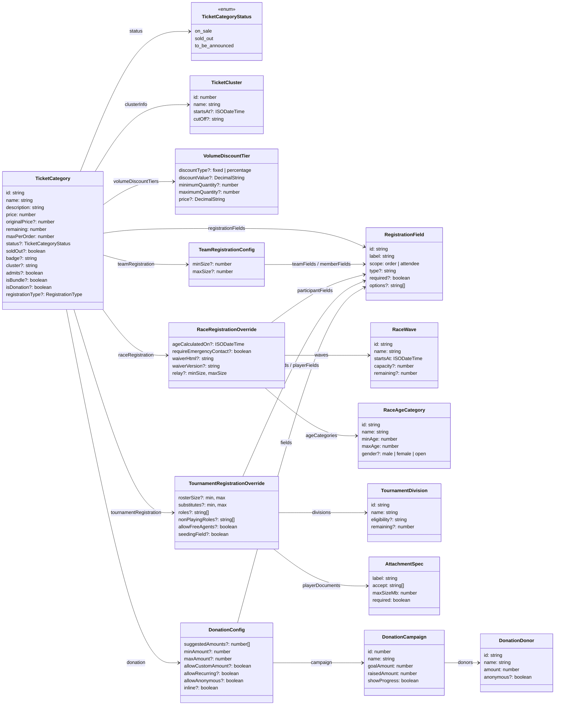

# TicketCategory Config

## Relationship View



## Types

```ts
type ISODateTime = string;
type DecimalString = string;
type RegistrationType = "general" | "team" | "group" | "individual" | string;
type TicketCategoryStatus = "on_sale" | "sold_out" | "to_be_announced";

type RegistrationField = {
  id: string;
  label: string;
  helpText?: string;
  placeholder?: string;
  required?: boolean;
  scope: "order" | "attendee";
  type?: "text" | "textarea" | "select" | "radio" | "checkbox" | "date" | "email" | "phone" | "number";
  options?: string[];
  min?: number;
  max?: number;
  step?: number;
};

type AttachmentSpec = {
  accept: string[];
  label: string;
  maxSizeMb: number;
  required: boolean;
};

type TeamRegistrationConfig = {
  minSize?: number;
  maxSize?: number;
  teamFields?: RegistrationField[];
  memberFields?: RegistrationField[];
};

type RaceWave = {
  id: string;
  name: string;
  startsAt: ISODateTime;
  capacity?: number | null;
  remaining?: number | null;
};

type RaceAgeCategory = {
  id: string;
  name: string;
  minAge: number;
  maxAge: number | null;
  gender?: "male" | "female" | "open";
};

type RaceRegistrationConfig = {
  ageCalculatedOn: ISODateTime;
  ageCategories?: RaceAgeCategory[];
  allowWaveSelection?: boolean;
  bibNameEnabled?: boolean;
  estimatedFinishRequired?: boolean;
  participantFields?: RegistrationField[];
  relay?: { minSize: number; maxSize: number } | null;
  requireEmergencyContact: boolean;
  requireMedicalInfo?: boolean;
  waiverHtml: string;
  waiverVersion: string;
  waves?: RaceWave[];
};

type RaceRegistrationOverride = Partial<RaceRegistrationConfig>;

type TournamentDivision = {
  id: string;
  name: string;
  description?: string;
  eligibility?: string;
  remaining?: number | null;
};

type TournamentRegistrationConfig = {
  allowFreeAgents?: boolean;
  teamFields?: RegistrationField[];
  divisions?: TournamentDivision[];
  nonPlayingRoles?: string[];
  playerDocuments?: AttachmentSpec[];
  playerFields?: RegistrationField[];
  roles?: string[];
  rosterSize: { min: number; max: number };
  seedingField?: boolean;
  substitutes?: { min: number; max: number };
};

type TournamentRegistrationOverride = Omit<
  Partial<TournamentRegistrationConfig>,
  "rosterSize" | "substitutes"
> & {
  rosterSize?: Partial<{ min: number; max: number }>;
  substitutes?: Partial<{ min: number; max: number }>;
};

type DonationDonor = {
  amount: number;
  anonymous?: boolean;
  givenAt?: ISODateTime;
  id: string;
  message?: string;
  name: string;
};

type DonationCampaign = {
  donors?: DonationDonor[];
  endsAt?: ISODateTime | null;
  goalAmount: number;
  id: number;
  name: string;
  raisedAmount: number;
  showDonorWall?: boolean;
  showProgress: boolean;
};

type DonationConfig = {
  allowAnonymous?: boolean;
  inline?: boolean;
  allowCustomAmount?: boolean;
  allowRecurring?: boolean;
  campaign?: DonationCampaign | null;
  dedication?: boolean;
  defaultAmount?: number | null;
  fields?: RegistrationField[];
  maxAmount?: number | null;
  minAmount?: number;
  prompt?: string;
  suggestedAmounts?: number[];
  taxReceipt?: boolean;
};

type TicketCluster = {
  cutOff?: string | null;
  description?: string | null;
  id: number;
  name: string;
  startsAt?: ISODateTime | null;
};

type VolumeDiscountTier = {
  discountType?: "fixed" | "percentage" | string;
  discountValue?: DecimalString;
  maximumQuantity?: number | null;
  minimumQuantity?: number;
  price?: DecimalString;
};

type TicketCategory = {
  id: string;
  name: string;
  description: string;
  price: number;
  originalPrice?: number;
  remaining: number;
  maxPerOrder: number;
  badge?: string;
  soldOut?: boolean;
  status?: TicketCategoryStatus;
  allowedCouponCodes?: string[];
  bundleItems?: Array<{ categoryId: string; quantity: number }>;
  bundleSize?: number;
  cluster?: string;
  separateRegistrationPage?: boolean;
  registrationFields?: RegistrationField[];
  admits?: boolean;
  cardImageUrl?: string;
  donation?: DonationConfig;
  isDonation?: boolean;
  raceRegistration?: RaceRegistrationOverride;
  teamRegistration?: TeamRegistrationConfig;
  tournamentRegistration?: TournamentRegistrationOverride;
  allowDirect?: boolean;
  apiId?: number;
  clusterInfo?: TicketCluster | null;
  currencyCode?: string;
  currencySymbol?: string;
  isBundle?: boolean;
  markSoldOut?: boolean;
  priority?: number;
  quantity?: number;
  registrationType?: RegistrationType;
  soldCount?: number;
  tags?: string[];
  volumeDiscountTiers?: VolumeDiscountTier[];
};
```
