# Tickify Event Details and Registration

This document describes the event-detail and registration system in Tickify. It is data-driven: each event independently selects a page template, a registration layout, a registration mode, where registration happens, an attendee-information policy, its ticket categories, and optionally conditional fields, donation support, an announcement before the sale, and its organizer's colours.

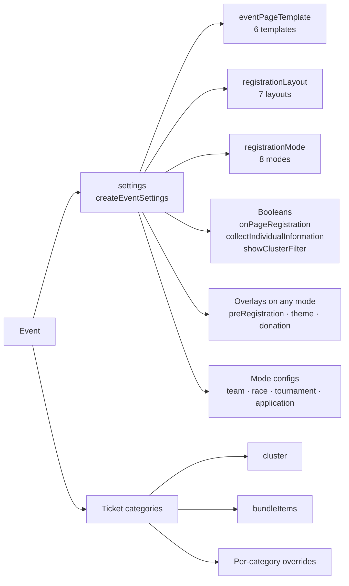

Template, layout and mode are independent axes. Choosing one never constrains the others at the type level; the compatibility rules later in this document say which combinations make sense.

## Naming conventions

All configuration keys are camelCase and match `src/constants/event-details-data.ts` exactly. Event-level options live inside `settings`, created through `createEventSettings`:

```ts
settings: createEventSettings({
  eventPageTemplate: "hero",
  registrationLayout: "sidebar",
  registrationMode: "single",
  onPageRegistration: true,
  collectIndividualInformation: false,
  showClusterFilter: false,
  status: "live",
});
```

These seven keys are required by `EventSettingsConfig`. Every other setting has a default and is optional:

| Setting                   | Purpose                                                                    |
| ------------------------- | -------------------------------------------------------------------------- |
| `clusterSelection`        | Whether clusters filter a list or gate it. Default `"filter"`.             |
| `priceLabel`              | What the price on a summary card is the price *of*. Default derived.       |
| `donation`                | Placement 1 when the mode is `donation`, placement 2 on any other.         |
| `preRegistration`         | An announcement before the sale. Not a mode config; any mode may have one. |
| `theme`                   | One organizer hex and the face it is set in. Not a mode config either.     |
| `applicationRegistration` | Questions, attachments, capacity and payment timing for `application`.     |
| `raceRegistration`        | Waiver, age categories, waves and entrant rules for `race`.                |
| `teamRegistration`        | Sizes and field defaults for `team`.                                       |
| `tournamentRegistration`  | Roster, divisions, roles and documents for `tournament`.                   |

`priceLabel` is a string the organizer sets, not a value derived from the mode. "Tickets from" is wrong as soon as an event is not selling tickets, and the mode cannot predict the right words: one organizer wants "Entry from", another "Registration from", "Suggested", or nothing, for reasons unrelated to the mode.

Earlier drafts used snake_case names that are now obsolete:

| Obsolete name              | Current name                            |
| -------------------------- | --------------------------------------- |
| `template`                 | `settings.eventPageTemplate`            |
| `on_page_registration`     | `settings.onPageRegistration`           |
| `individual_info_required` | `settings.collectIndividualInformation` |
| `show_cluster_filter`      | `settings.showClusterFilter`            |

## Routes

| Route                                    | Purpose                                                                                 |
| ---------------------------------------- | --------------------------------------------------------------------------------------- |
| `/events`                                | Browse and filter events.                                                               |
| `/events/[slug]`                         | Render an event with its configured detail template.                                    |
| `/events/[slug]/register`                | Event-level separate registration page, used when `onPageRegistration` is `false`.      |
| `/events/[slug]/register/[categoryId]`   | Dedicated page for a category with `separateRegistrationPage: true`.                    |
| `/events/[slug]/apply`                   | Application submission, for `application` mode.                                         |
| `/events/[slug]/application/[reference]` | Application status, for `application` mode after submission.                            |
| `/events/[slug]/donate`                  | Standalone donation page, for placements 1 and 2.                                       |

The event route also provides responsive loading and not-found states.

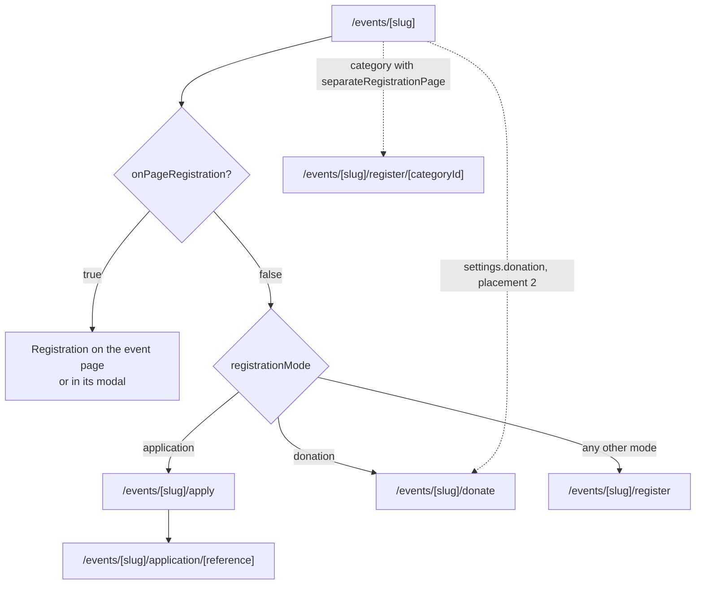

## Event detail templates

| Template   | Intended use                                                    |
| ---------- | --------------------------------------------------------------- |
| `hero`     | Immersive full-width image hero.                                |
| `split`    | Split content-and-artwork hero.                                 |
| `agenda`   | Schedule-focused conference presentation.                       |
| `poster`   | Bold poster style for festivals and visual events.              |
| `campaign` | Fundraising presentation with goal, progress and story.         |
| `race`     | Course details, distances, start times and race-day schedule.   |

Events without a custom detail record receive a fallback template based on their browse categories.

## Registration layouts

Registration presentation is independent of the detail template, so `hero` with `catalog` and `poster` with `modal` are both valid.

| Layout          | Behaviour                                                                                                  |
| --------------- | ---------------------------------------------------------------------------------------------------------- |
| `sidebar`       | Sticky desktop sidebar; appears before the event details on mobile.                                        |
| `inline`        | In the main content column, before the event details.                                                      |
| `modal`         | A compact call to action opens the standard form in a modal.                                               |
| `catalog`       | Full-width area. `multi` uses the searchable cart; other modes use their mode-specific form.               |
| `catalog-modal` | Same as `catalog`, inside a modal.                                                                         |
| `wizard`        | Full-page multi-step flow with no sidebar: a progress indicator and one step per screen.                   |
| `amount`        | Suggested tiers, custom input and optional campaign progress.                                              |

## Event theming

An event may carry its organizer's colours through `settings.theme`. It is not a mode config, because a race, a gala and a relief fund all have a brand, and presence is the flag, as with `preRegistration` and `playerDocuments`.

```ts
theme: {
  accent?: string,                            // a hex, the only colour authored
  fontStyle?: "sans" | "heading" | "display", // headings only
}
```

### One hex in, a whole palette out

`resolveEventTheme` derives everything else per colour scheme: the label on the accent, the canvas, the cards and the chrome. An earlier shape let organizers author all of those, and each one was a way to get it wrong: a light accent with a light label, a canvas dark enough to hide the sold-out pill, a dark block that kept a light label at 2.71:1. Deriving removes those failures instead of reporting them.

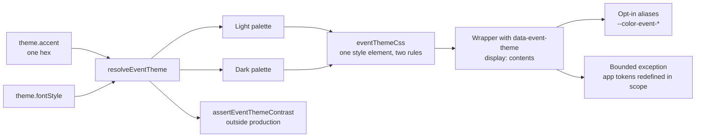

The type is deliberately not a stylesheet. It holds closed sets and hex values, never a class name, a font URL or raw CSS, because each of those would let event content decide what the application renders rather than how it looks. `fontStyle` names a role, mapped onto the three faces `globals.css` already imports from `@fontsource`, so a theme can never introduce a `@font-face` or a new request. `mono` is excluded on purpose: monospaced body copy is a mistake, not a brand.

There is no radius key. Only `rounded-sm/md/lg/xl` resolve to `--radius`, and the templates use those 16 times against 80 fixed-scale corners, so a radius control would move a sixth of the page and leave the rest square, which reads as a bug. Adding one means widening the templates first, which is a redesign.

### What the derivation guarantees

The palette is derived in TypeScript, not CSS. `color-mix()` and relative colours would put every value where no assertion can read it, and an unmeasurable palette is exactly what this feature learned not to ship. The maths is HSL (same hue and saturation, different lightness). HSL is not perceptually uniform, which does not matter: every value is measured against a contrast bar before use, so the search corrects for the colour space.

| Derived | Rule |
| ------- | ---- |
| `accent` | The authored hex, unchanged, in both schemes. |
| `accentForeground` | Near-black or near-white, whichever reads better on the accent. One value, because the accent does not move. |
| `background` | The canvas, a low-saturation tint of the hue. In light mode it is raised until it clears `#f4e9e1`. |
| `surface` | The cards, lifted off the canvas in both schemes: same hue, higher lightness. |
| `accentBorder` | A hairline of the same hue, present only in the scheme where the fill cannot reach 3:1 against its ground. `null` (resolving to `transparent`) everywhere else. |
| `border`, `input`, `ring` | Chrome. `input` is searched until it clears 3:1 against the cards, which `--control-border` documents as a requirement. `ring` is the accent, since a focus ring is the one piece of chrome that should look chosen. |
| `muted`, `mutedForeground`, `secondary`, `secondaryForeground` | Chips and secondary badges, with text searched until it keeps 4.5:1 on its own wash. |

The accent is never substituted. An earlier version replaced an invisible fill with a different colour, which hid the check and quietly changed the brand. Now the fill is always the authored colour, and where it has no visible edge the derivation draws one.

`THEME_LIGHT_CANVAS_FLOOR` (`#f4e9e1`) is measured, not picked. Below it, the availability pill and the disabled control, both deliberately excluded from theming, fall under 4.5:1 against the canvas. Excluding an element protects it from an organizer's palette but not from an organizer's canvas, because contrast is a relationship and only one side is excluded. So the derivation refuses to produce a canvas that would break them.

### Tokens, and the two ways they are set

Most of the palette is **opt-in**: a component asks for `bg-event-surface` and gets it. Every alias falls back to the token it replaces, so an unthemed page paints exactly what it painted before.

| Alias | Falls back to |
| ----- | ------------- |
| `--color-event-accent` | `--accent` |
| `--color-event-accent-foreground` | `--accent-foreground` |
| `--color-event-accent-text` | `--accent-emphasis`, not `--accent`: volt measures 1.61:1 on a white card and cannot be read as text. Falling back *to* an excluded token is not redefining it. |
| `--color-event-accent-border` | `transparent` |
| `--color-event-background` | `--background` |
| `--color-event-surface` | `--surface` |
| `--color-event-ground` | `--pine` |
| `--color-event-panel` / `-foreground` / `-accent` | `--pine-n80` / `--paper` / `--volt`: the inverted venue tile and its chip |
| `--color-event-hero-wash` / `-ink` | A mode-aware base, because the poster hero is painted the other way up and already differs by scheme |
| `--event-font` | `--font-heading`, reaching headings only |

The rest cannot be opt-in, and that is the **bounded exception**. `--border`, `--input`, `--ring`, `--muted`, `--muted-foreground`, `--secondary`, `--secondary-foreground`, `--surface`, `--background` and `--elevation-hairline-hover` are the application's own tokens, redefined inside the event subtree. They come from shared primitives (`ui/input.tsx` paints `border-input`, `ui/card.tsx` paints `border-border`), and editing those would repaint every route for one page. Redefining the token under a scoped selector reaches the primitive without touching it.

`--surface` is on the list because `ui/input.tsx` paints `dark:bg-surface` rather than `bg-input`. Field borders moved with `--input` while field backgrounds stayed the application's, which a computed-style sweep found and a class grep could not.

### The exclusion list is the boundary

An exception is only bounded if something says where it stops. These tokens may never appear in a themed block, and `event-theme.test.tsx` fails if one does:

```
--accent · --accent-foreground · --accent-emphasis
--destructive · --destructive-foreground
--primary · --primary-foreground
--status-upcoming · --status-upcoming-foreground
--status-neutral · --status-neutral-foreground
```

`accent` does two jobs here, brand and status: `statusTone` fills `live` and `ongoing` with `bg-accent`, so pointing an organizer's palette at it would repaint "Registration open" in their brand colour. `destructive` means sold out and cancelled. The disabled control, `unavailableClassName`, is `bg-foreground/10 text-muted-foreground`, and `--foreground` is never declared, so reading text stays the application's throughout.

**A brand may colour what an event is selling. It may not colour whether the event is selling, or recolour a control that cannot be pressed.**

`--secondary` and `--muted` were on the list until status moved to tokens of its own (see *Status moved to its own tokens* under Implementation decisions).

### How it is applied

`EventDetailRenderer` emits one `<style>` element beside a wrapper carrying `data-event-theme="<slug>"`, with two rules keyed on that attribute. An inline `style` attribute cannot vary by colour scheme, and this palette must: a brand that reads on white usually does not read on `#081c1c`.

The dark selector is `.dark`, not `prefers-color-scheme`, and this is load-bearing. The application uses `next-themes` with `attribute="class"`, so a media query would give the dark palette to a reader who forced light mode on a dark system. `.dark` is also set by the blocking script `next-themes` puts in the head, so the theme resolves at first paint in a static prerender: no flash, no effect, nothing read on the client.

The wrapper is `display: contents`, which is also load-bearing. Every template roots at `<main className="flex-1">`, a flex child of the site shell. A wrapper that generated a box would become that child instead, `flex-1` would stop reaching the shell, and the footer would ride up under short pages (measured at 18px of main against 712px). Custom properties inherit through the DOM either way.

No theme means no element: an unthemed event renders exactly the markup it rendered before, which is what makes the aliases a fallback rather than a rewrite.

Dialogs are the exception to inheritance, because they are portaled to `document.body`, outside the wrapper. `EventRegistrationModal` carries the same attribute rather than a copy of the palette. The rule is a plain global selector and `.dark` still sits on `<html>` above the portal, so both schemes match unchanged and it is inert on an unthemed event.

### Assertions and the sweep

`assertEventThemeContrast` runs outside production and checks three things per scheme: accent against its label at 4.5:1, and accent against both canvas and cards at 3:1. Each failure names its scheme, because "passes light, fails dark" is the normal shape of the answer and an averaged verdict would hide it.

The two levels mean different things. `console.error` is a colour nobody can use: text under 4.5:1, or a fill with no edge any hairline can carry. `console.warn` is the derivation doing its job: the accent kept, an edge drawn around it. They shared `console.error` until a correctly behaving theme showed up in the dev overlay looking like a crash.

`THEME_SURFACES` holds the two hexes the assertion measures against, because a constants module cannot read a computed stylesheet. That is a second copy of a fact, so `theme-surfaces.test.ts` pins it against `globals.css`. A designer who moves `--paper` or `--pine-n60` gets a failure naming both files instead of a check that silently measures against a colour the application no longer paints.

`scripts/theme-sweep.ts` drives headless Edge over the DevTools protocol and walks the event subtree comparing **computed** colours against the application palette and the theme's values. The first version read class lists, which cannot see through a primitive: fields painting `dark:bg-surface` looked correct in every grep.

## Registration modes

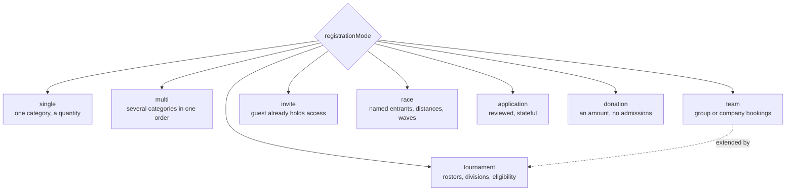

### `single`

The buyer selects one ticket category and a quantity.

- One lead-attendee form
- Optional form for every ticket holder through `collectIndividualInformation`
- Event and category conditional fields
- Ticket availability and per-order limits
- Optional category-level registration page

### `multi`

The buyer combines several categories in one order.

- Independent quantity per category
- Bundle categories can be mixed with single categories
- One lead-attendee form when individual details are not required
- Event and order fields are completed once
- Categories can optionally be organised into filterable clusters

### Cluster organisation

Clusters group ticket categories into sessions, zones, dates or other groups. They are category metadata, not a mode.

- Includes an `All` filter
- Search covers ticket names, descriptions and clusters
- The full catalog layout supports a desktop right-side cart; mobile uses a bottom cart bar and drawer
- One lead-attendee form appears in the cart, with event-level additional fields shown once
- Every selected category has a delete action, and removing a bundle clears its attendee data

Any mode can show the filter when categories have `cluster` values and the event sets `showClusterFilter: true`. The filter appears only when at least one category has a cluster; setting it to `false` hides the filter but keeps the data.

A second setting decides whether clusters filter a list or gate it:

```ts
clusterSelection: "filter" | "required"; // Default "filter"
```

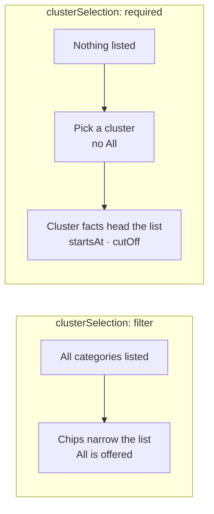

The test is whether the clusters are **stages of one choice** or **facets of one browse**. A race distance is a stage: nobody enters both the 10K and the half, and the entry types inside a distance only mean anything once it is chosen. A festival's sessions are stages for the same reason. Winter Charity Gala's Seating and Support the cause are facets: a guest may want one of each, so forcing a choice would be wrong.

A cluster can carry facts of its own, which is how a race distance holds its start time and cut-off (see `TicketCluster` under `race`).

### `team`

For group or company bookings.

- Category selection stays inline or opens a dedicated category page
- Dedicated categories use a three-step Team → Participants → Review wizard
- Configurable minimum and maximum team size (`minSize: 1` is supported)
- Team name and team-scoped fields are completed once
- Name, email, phone and member-scoped fields are completed for every participant
- Participant 1 is the team captain and primary contact
- Participant emails must be unique so tickets can be delivered individually
- Pricing and availability are per participant

```ts
teamRegistration: {
  minSize: 2,
  maxSize: 10,
  teamFields: [],   // Completed once for the team
  memberFields: [], // Completed for every participant
}
```

Event and category fields with `scope: "order"` merge into team fields; `scope: "attendee"` fields merge into participant fields. These defaults belong to one event, and a ticket category may provide its own `teamRegistration`.

**Override resolution** is implemented in `resolveTeamRegistration` and reused by every mode with both event and category configuration:

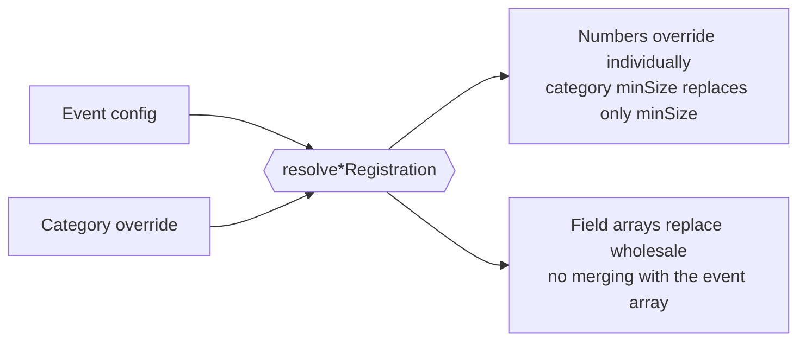

### `invite`

For private or approval-based events where the guest already holds access.

- Invited email address
- Optional invitation code
- Access verification and request messaging
- Runs on the event page or a separate registration page

Verification is synchronous: the guest enters a code and immediately learns whether it is valid. When a human must review access before granting it, use `application`.

### `race`

For marathons, cycling events, triathlons and any timed event where every entrant is a named individual with their own bib.

- A distance is a cluster; the entry types within it are ticket categories, each with its own price, availability and per-order limit
- The distance carries gun time and cut-off, because General, Student and Member entries into one 10K share both
- Age category is derived from date of birth and shown live as the entrant types
- Waves are optional and have capacity independent of category availability
- A versioned waiver must be accepted before checkout
- An optional relay variant collects a roster instead of one participant

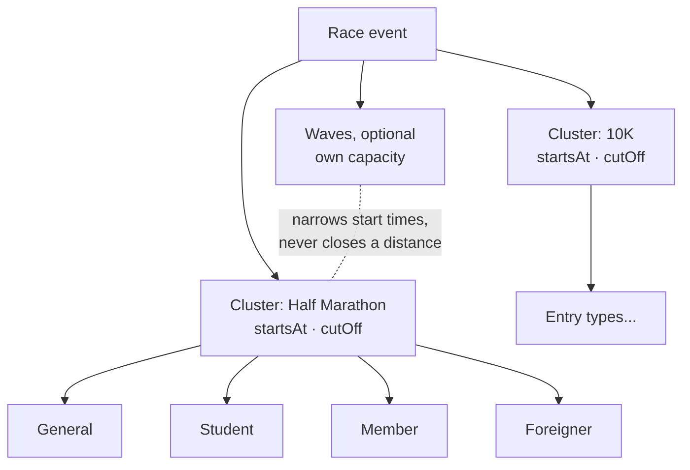

Distances are clusters because one distance sells several entry types. Half Marathon General, Student, Member and Foreigner are four prices for one race that starts and closes together, so start time and cut-off belong to the distance instead of being written four times.

```ts
export type TicketCluster = {
  /** "2h 50m", or absent where the distance has no cut-off. */
  cutOff?: string | null;
  description?: string | null;
  id: number;
  name: string;
  startsAt?: ISODateTime | null;
};
```

Both race shapes ship. Dhaka Marathon stages its five distances behind `clusterSelection: "required"` and sets `allowWaveSelection: false` with no `waves`, because the organizer assigns them. Dhaka Cycling Challenge lists its distances in a catalog and offers three start waves, so a rider picks a distance and a time.

`collectIndividualInformation` is ignored and treated as `true`: every admission is a named entrant.

```ts
export type RaceWave = {
  id: string;
  name: string; // "Wave A — 6:00 AM"
  startsAt: ISODateTime;
  capacity?: number | null;
  remaining?: number | null;
};

export type RaceAgeCategory = {
  id: string;
  name: string; // "M40–44"
  minAge: number;
  maxAge: number | null;
  gender?: "male" | "female" | "open";
};

export type RaceRegistrationConfig = {
  ageCalculatedOn: ISODateTime; // Usually race day, sometimes 31 December
  ageCategories?: RaceAgeCategory[];
  allowWaveSelection?: boolean; // false = the organizer assigns waves
  bibNameEnabled?: boolean;
  estimatedFinishRequired?: boolean;
  participantFields?: RegistrationField[];
  relay?: { minSize: number; maxSize: number } | null;
  requireEmergencyContact: boolean;
  requireMedicalInfo?: boolean;
  waiverHtml: string;
  waiverVersion: string;
  waves?: RaceWave[];
};
```

Standard participant fields, all `scope: "attendee"`: date of birth, gender, nationality, bib name, T-shirt size, club affiliation, estimated finish time, emergency contact name and phone, relationship to entrant, medical conditions, blood group, and the waiver checkbox.

Two behaviours need logic rather than plain fields. Age category is computed from date of birth against `ageCalculatedOn` and shown immediately so the entrant can confirm it. Wave capacity decrements separately from category `remaining`, so a preferred wave can be full while its distance is still open.

### `tournament`

For competitive team events with rosters, divisions and eligibility rules. Extends `team` and reuses its override resolution.

- Divisions are ticket categories, so a full division behaves exactly like a sold-out category
- Roster size is often exact rather than a range
- Players carry roles, and non-playing roles can be excluded from pricing
- Each player may need an eligibility document
- Optional free-agent entry places a solo player into a pool

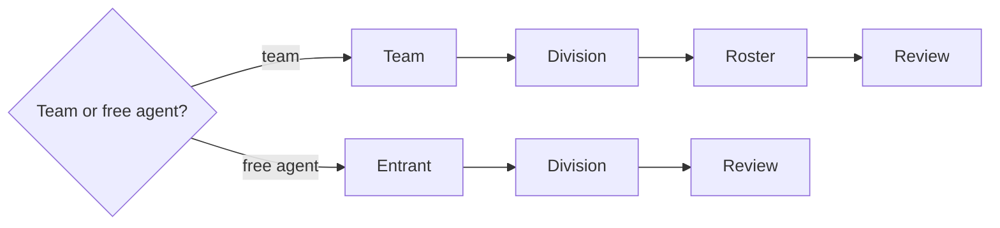

A free agent has no roster, so that flow drops the step instead of showing an empty one.

```ts
export type TournamentDivision = {
  id: string;
  name: string; // "Open", "Under-19", "Women's"
  description?: string;
  eligibility?: string;
  remaining?: number | null;
};

export type TournamentRegistrationConfig = {
  allowFreeAgents?: boolean;
  divisions?: TournamentDivision[];
  nonPlayingRoles?: string[]; // Names from `roles` that are not priced
  playerDocuments?: AttachmentSpec[]; // Presence is the flag; no boolean beside it
  playerFields?: RegistrationField[];
  roles?: string[]; // "Captain", "Player", "Substitute", "Coach"
  rosterSize: { min: number; max: number };
  seedingField?: boolean; // Prior rank or rating
  substitutes?: { min: number; max: number };
  teamFields?: RegistrationField[]; // Completed once, like teamRegistration.teamFields
};
```

`collectIndividualInformation` is ignored and treated as `true`.

### `application`

For events where access is requested, reviewed by the organizer and granted later. It is stateful: the applicant submits, leaves, and returns to a record.

- Submission form with organizer-defined questions and file attachments
- A reference code issued on submission
- A status page the applicant can return to
- Payment can be deferred until approval

```ts
export type ApplicationStatus =
  | "draft"
  | "submitted"
  | "under_review"
  | "approved"
  | "payment_pending"
  | "confirmed"
  | "waitlisted"
  | "rejected"
  | "withdrawn";

export type AttachmentSpec = {
  accept: string[];
  label: string;
  maxSizeMb: number;
  required: boolean;
};

export type ApplicationRegistrationConfig = {
  allowResubmission?: boolean;
  applicationFields: RegistrationField[];
  attachments?: AttachmentSpec[];
  capacity?: number | null; // Across the programme; a track's own is `remaining`
  decisionBy?: ISODateTime | null;
  paymentTiming: "on_submit" | "on_approval" | "none";
  reviewMessage?: string; // Shown while under review
  statusMessages?: Partial<Record<ApplicationStatus, string>>;
  submissionClosesAt?: ISODateTime | null;
};
```

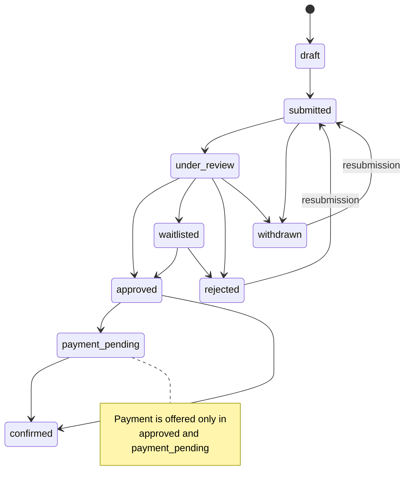

The transitions are illustrative. What the code fixes is narrower: the offer to pay appears only in `approved` and `payment_pending`, and resubmission is offered only from `rejected` and `withdrawn`. Both rules are asserted for all nine states.

`paymentTiming: "on_approval"` means an order exists before payment does. That ordering appears nowhere else in the system and depends on backend order creation (see Prototype boundary).

The status route is the point of this mode. Without `/events/[slug]/application/[reference]`, an application is a form the applicant cannot follow up on.

**A track is a ticket category.** Programmes that vary questions by track, strand or intake use the categories the event already has: a track has a price payable on approval, a capacity and a description, which is a category. Its order-scoped `registrationFields` merge into `applicationFields` when chosen. One track is context and asks nothing; two or more produce a chooser.

`capacity` and a track's `remaining` answer different questions and both are kept: the first caps the whole programme, the second allocates within one track, so Photography can close while Film stays open. `assertTrackCapacity` throws outside production when allocations exceed the cap, because two numbers describing one pool drift silently.

### `donation`

Donation is both a mode and a layer. See the next section.

## Donation

Donation is defined once and can appear in four placements, several at once.

```ts
export type DonationDonor = {
  amount: number;
  anonymous?: boolean; // Counts toward the total, shows as "A private donor"
  givenAt?: ISODateTime;
  id: string;
  message?: string;
  name: string;
};

export type DonationCampaign = {
  donors?: DonationDonor[];
  endsAt?: ISODateTime | null;
  goalAmount: number;
  id: number;
  name: string;
  raisedAmount: number;
  showDonorWall?: boolean;
  showProgress: boolean;
};

export type DonationConfig = {
  allowAnonymous?: boolean;
  allowCustomAmount?: boolean;
  inline?: boolean; // The one field that moves placement 2 to placement 4
  allowRecurring?: boolean;
  campaign?: DonationCampaign | null;
  dedication?: boolean; // "In honour of" / "In memory of"
  defaultAmount?: number | null;
  fields?: RegistrationField[]; // Tax receipt, employer match, gift aid
  maxAmount?: number | null;
  minAmount?: number;
  prompt?: string; // "Support the cause"
  suggestedAmounts?: number[]; // Tier chips
  taxReceipt?: boolean;
};
```

### The four placements

| # | Shape | Turned on by |
| - | ----- | ------------ |
| 1 | Donation-only event | `registrationMode: "donation"`, `amount` layout, `campaign` template. Ticket categories unused. |
| 2 | **Donate action on a ticketed event** | `settings.donation`. A donate action sits beside the ticket CTA and leads to `/events/[slug]/donate`. The ticket flow is untouched. |
| 3 | Donation as a ticket category | `isDonation: true` with `admits: false` on a category. |
| 4 | Inline donation in the cart or lead form | `settings.donation.inline: true`. Renders below the order questions and above the total. |

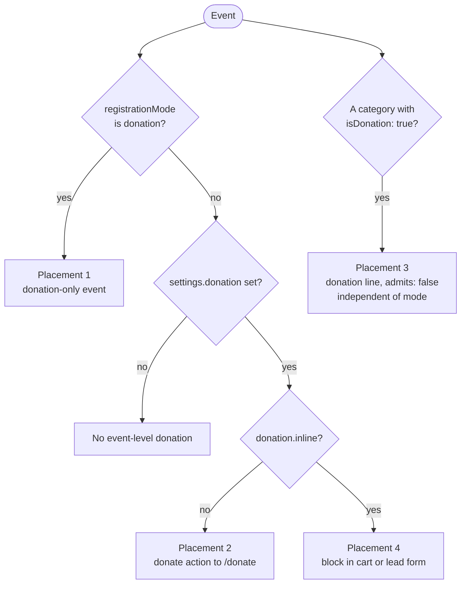

Placement 2 is the default reading of `settings.donation` because it matches what campaigns on this platform do: a ticketed event sells tickets normally and carries a separate donate action, so giving never interrupts buying. `inline` is the single field that moves it to placement 4.

Placements 1 and 2 share one page and one form. Placement 4 shares only the block.

### Category additions

```ts
// TicketCategory
admits?: boolean;   // Default true. false = no QR ticket is issued
cardImageUrl?: string;
donation?: DonationConfig;
isDonation?: boolean;

// Per-category overrides for the modes that have them
raceRegistration?: RaceRegistrationOverride;       // Partial<RaceRegistrationConfig>
teamRegistration?: TeamRegistrationConfig;
tournamentRegistration?: TournamentRegistrationOverride;
```

`admits: false` keeps donation lines out of the bundle-aware admission count. The same flag will later apply to add-on-only lines.

It does not keep them out of the order. **Emptiness and validity are a count of lines; the admission count is a count of people.** An order of one donation holds something and admits nobody. A donation-only order on a ticketed event is valid and proceeds with the lead form (see *A donation-only order is a valid order*).

### Resolution rules

| Condition                                   | Result                                    |
| ------------------------------------------- | ----------------------------------------- |
| `registrationMode: "donation"`              | Placement 1.                              |
| Any other mode with `settings.donation` set | Placement 2.                              |
| Both of the above                           | A campaign event that also sells tickets. |
| `isDonation: true` on a category            | Placement 3, independent of the mode.     |

## Availability and event status

Every registration surface asks one question before drawing anything: `getEventRegistrationAvailability(event, viewer?, now?)` in `src/constants/event-details-data.ts`. It returns a label, a description, the categories still on sale, and a state:

```
cancelled · closed · coming_soon · early_access · ended
open · paused · pre_registration · sold_out · unavailable
```

`canRegister` is `state === "open" || state === "early_access"`, the two states in which somebody may buy. **Almost every consumer branches on `canRegister` and prints `label` and `description`; they do not branch on `state`.** That is why adding a state costs nothing at the fifteen call sites, and why changing `canRegister` changed every buy surface at once when early access landed.

Only two places read `state` directly, both for pre-registration: `pre_registration` is the one blocked state with something to offer, so `EventRegistrationAction` and `RegistrationStatusCard` draw a CTA there instead of a notice. `pre-registration-action.tsx` reads `early_access` to decide when to swap that CTA for the buy action. Anything else reading `state` is reimplementing a decision this module already made.

`now` is a parameter, not a clock read, so a server render and its hydration get the same instant. Note the consequence: `/events/[slug]` is prerendered, so a server render happens at **build** time. Time-dependent states therefore resolve on the client. Do not thread `now` down from the page, or every announced event freezes at the moment CI ran.

### Precedence

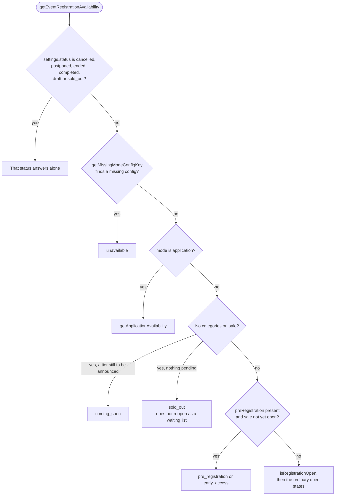

1. The `settings.status` switch. `cancelled`, `postponed`, `ended`, `completed`, `draft` and `sold_out` answer first and alone.
2. `getMissingModeConfigKey`: a mode with no configuration has no form to draw, so it reports `unavailable` instead of crashing.
3. The `application` branch, delegating to `getApplicationAvailability`.
4. An empty category list, and *why* it is empty. A pending tier reads `coming_soon`; nothing pending reads `sold_out`.
5. Pre-registration, if the key is present and the sale has not opened.
6. `isRegistrationOpen`, then the ordinary open states.

### `isRegistrationOpen` and `registrationOpensAt` describe one fact

The boolean says whether the event is selling; the timestamp says when it starts. Nothing flips the boolean when the timestamp passes, so they can disagree. `assertPreRegistrationWindow` reports both directions outside production: the boolean true while the sale is still in the future, and the boolean false after the sale date has passed. The second is what an announced event drifts into when its dates are left behind, and it renders "Registration opens soon" on a date already gone.

The assertion is a marker, not the fix. Deriving the boolean from the timestamp would change how every event on the platform decides it is selling, which is a wider change than this module warrants.

### An event's status closes its applications

`getApplicationAvailability` is the one resolver a route reaches without going through `getEventRegistrationAvailability`: `/apply` renders `ApplicationForm`, which calls it directly. So it runs its own status table first, mapped onto its four states: `sold_out` becomes `full`, `draft` becomes `unavailable`, and the rest become `closed`. Without this, a cancelled programme said "Applications are open" and drew a working form while the event page correctly said otherwise.

### The routes are gated, and the gate is presentational

`getRegistrationGate(event, category?, viewer?, now?)` in `src/lib/registration-gate.ts` is called by `/register`, `/register/[categoryId]`, `/apply` and `/donate` before rendering a form. It adds what the event resolver cannot express: an open event can hold a category that is off sale. It asks the same `getCategoryStatus` that `availableCategories` filters on, so the layers cannot disagree, and it asks for the status rather than the predicate because the two refusals need opposite messages.

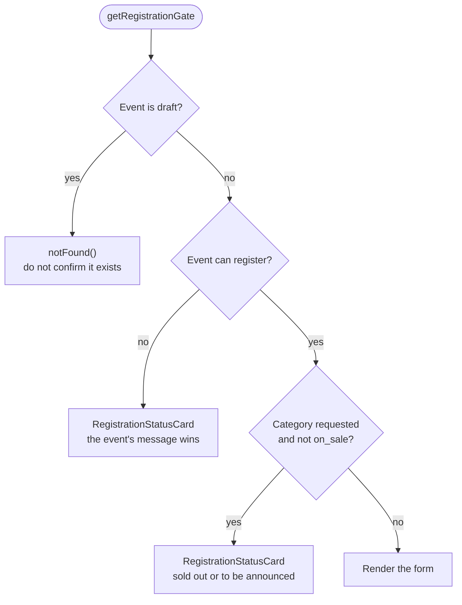

Precedence is **event before category**: someone whose event has not opened does not need to hear that one distance inside it is full. A blocked route renders `RegistrationStatusCard` in place instead of redirecting, because a redirect loses the reason. A `draft` event returns `notFound()`, because an unpublished event should not confirm it exists.

The gate decides what a visitor sees and enforces nothing. Rejecting orders against a closed event, a sold-out category, or a claimed early-access window is server-side work, listed as `TODO(api)` in the module.

### The organizer's own words

`content.comingSoonText` and `content.soldOutText` replace the *description* of the `coming_soon` and `sold_out` states. Labels stay derived: they name the state, and an organizer renaming a state could put "On sale now" over a surface that sells nothing. `sold_out` has two producers, the event's status and an exhausted category list, and both read the override.

`soldOutText` wins only over the sentence it was written for. The category gate once borrowed it for every refusal, so "This zone is currently sold out." would have described a tier nobody had priced yet.

## Ticket category status

Each ticket category has its own status, separate from the event's. `getCategoryStatus(category)` resolves one of three:

```
on_sale · sold_out · to_be_announced
```

The three availability flags (`soldOut`, `markSoldOut`, `remaining <= 0`) answer "can this be bought", which was enough while the only answers were yes and no. A line the organizer has not priced or dated yet is a third answer, and it is not sold out. Telling a reader "Sold out" about a tier that never went on sale tells them they missed something that never happened, and they stop coming back.

`isCategoryAvailable(category)` is `getCategoryStatus(category) === "on_sale"`, derived from the status, so the one predicate five surfaces share stays one predicate.

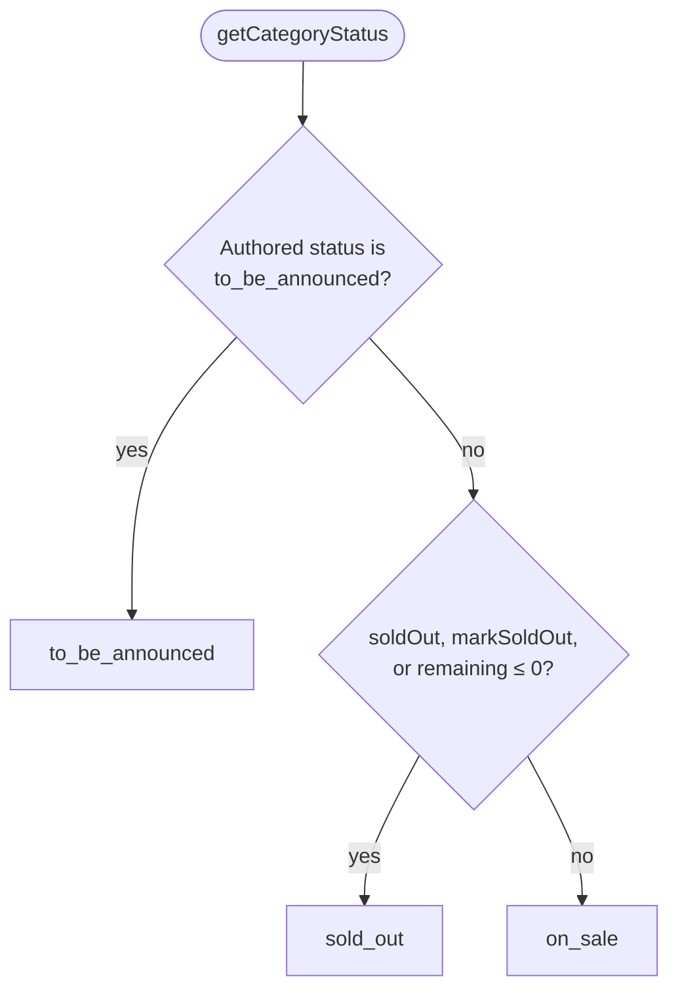

### Only one value is authored, and it can only close a line

`sold_out` is derived: it is a fact about inventory, not something anyone types. `to_be_announced` is the only value data sets.

**Order is the load-bearing part.** The authored status is read *before* the count, because an unannounced tier's `remaining` is a placeholder zero and reading it first would paint the tier red.

The reverse does not hold for `on_sale`. Inventory is a floor: an authored status may close a line but never open one. `status: "on_sale"` on a category with no stock is ignored.

`markSoldOut` is what makes the consolidation more than tidiness. It is API metadata, and until the surfaces were consolidated nothing that *drew* read it, so the first API response carrying it would have rendered those categories as buyable while the session silently refused them. No sample event sets it, which is why nobody noticed.

### One word per status, in one place

`CATEGORY_STATUS_LABELS` holds the copy. It also settled an older inconsistency: the registration card said "Sold out" and the catalog card said "Unavailable" for the same condition.

| Status | Label | Treatment |
| ------ | ----- | --------- |
| `on_sale` | `null` | A line on sale shows a price and a control. An "On sale" chip on every healthy row is noise. |
| `sold_out` | `"Sold out"` | Destructive tint, destructive edge, name in the same hue. Red because something ran out. |
| `to_be_announced` | `"To be announced"` | Quiet: muted name, neutral chip. Nothing went wrong, and the sold-out treatment would erase the distinction. |

Neither closed state shows a price, because a placeholder zero renders as "Free", the most wrong thing a card can say about an unpriced tier. The word always stays in the chip, so state is never carried by colour alone.

### Where the status is asked

| Surface | Asks for |
| ------- | -------- |
| `registration-store.ts` | The predicate: it drops any line failing it |
| The ticket card and the catalog card | The status, to dress and label the row |
| The multi-mode stepper, team wizard, tournament wizard | The predicate |
| The bundle configurator, at all four call sites | The predicate, before the dialog opens |
| `getRegistrationGate` | The status, to phrase the refusal |
| `ClusterStage` | The status, for the chip on a distance tab |
| `getEventRegistrationAvailability` | The status, to decide why its list is empty |

The roll-ups use `some`, not `every`: a line-up half announced and half still to come is not sold out, and the tiers still to come are exactly what a reader would return for.

## Pre-registration and notify me

An event can be announced before it sells. The buy CTA is replaced by a pre-register or notify-me CTA until tickets open, and pre-registrants can optionally buy during an early-access window.

**It is not a `RegistrationMode`.** Every mode can announce early, so it sits beside the mode configs on `EventSettings` and overlays whatever surface the event already renders. It is absent from `getMissingModeConfigKey`, which switches on mode; a missing key simply leaves the event reading as it would without one.

```ts
preRegistration: {
  cta: "pre_register" | "notify_me",
  ctaLabel?: string,              // overrides the label derived from `cta`
  confirmationMessage?: string,
  fields?: RegistrationField[],   // every one `scope: "order"`
  loginRequired?: boolean,
  capacity?: number | null,       // presentational; see below
  opensAt?: ISODateTime | null,
  closesAt?: ISODateTime | null,  // defaults to `registrationOpensAt`
  earlyAccess?: { startsAt: ISODateTime, eligibility?: "all" | "selected" },
  notifications?: ("email" | "sms" | "whatsapp" | "push")[],
}
```

Presence is the flag on both objects: the organizer's toggle adds or removes the object, with no boolean beside it to disagree. The early-access **window is derived** (`registrationOpensAt` minus `earlyAccess.startsAt`) and never stored, because a third number could contradict the two instants that define it, and no check could catch that drift.

`closesAt` is unrelated to `settings.registrationClosesAt`, which closes the sale rather than the list. An absent `closesAt` closes the list when the sale opens, which is what makes the module remove itself.

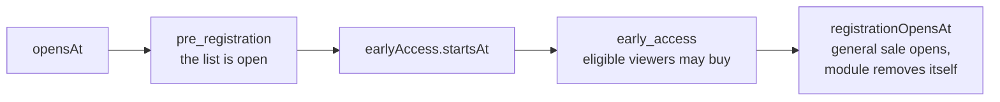

### States

The two new availability states are `pre_registration` and `early_access`. `getPreRegistrationAvailability(event, viewer?, now?)` owns every string the module renders, including those the event-level branch shows, which copies `label` and `description` verbatim. One copy table, one viewer check.

Eligibility is `viewer?.status === "registered"`, plus `viewer.earlyAccessGranted` when `earlyAccess.eligibility` is `"selected"`. With no viewer the state is `pre_registration`, the safe direction: it offers the list, not a buy button nobody can use.

### Viewer state, and the prototype boundary

Whether the viewer is on the list is server state, so it is a separate type read through one module, `src/lib/pre-registration-viewer.ts`, mocked for now:

```ts
type PreRegistrationViewer = {
  status: "none" | "registered";
  registeredAt?: ISODateTime;
  earlyAccessGranted: boolean;
  listFull?: boolean;
  profile?: { name?: string; email?: string; phone?: string };
};
```

`profile` lets the form avoid asking whether anyone is signed in: it draws an input for each of the three values it was not given, and a confirm step when it has all three. That is one flow instead of separate logged-in and logged-out branches. Nothing under `"use client"` reads the session: `lib/auth/session.ts` is `server-only`, and `SessionUser` has no phone number anyway.

`listFull` is the only producer of the `full` state. `capacity` renders a number if the organizer wants one and is checked server-side at submit; a browser sees only its own registration, so any count it derives under-reports. Duplicates and notification delivery are also server-side.

### Where the clock lives

The CTA in `pre-registration-action.tsx` is the one place a clock and a viewer meet.

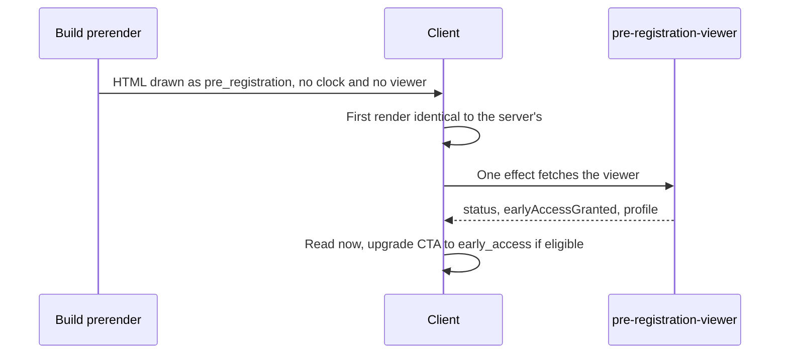

The prerendered server render has neither clock nor viewer, so it draws `pre_registration`. That is what gets cached, shared and indexed, and it is correct on its own, since without a viewer there is no early access to offer. The upgrade to `early_access` is private to whoever holds a viewer and lands as a re-render, not a flash.

Known gap: a direct category URL is prerendered without a viewer, so it blocks even someone genuinely inside the window. Early access is incomplete until that route can resolve a viewer.

### Assertions

`assertPreRegistrationWindow` reports through `console.error` and dedupes per `slug:key`, because every case has a graceful fallback. `assertPreRegistrationFields` throws, because a field scoped to an attendee a pre-registration does not have, or one duplicating the name, email or phone every list already collects, has no sensible fallback.

## Registration location

`onPageRegistration` controls where the main registration journey appears.

- `true`: registration stays on the event page. Catalog layouts keep selection and the cart there or inside the configured modal.
- `false`: the event page shows a registration CTA and the flow moves to its own route.

| Mode          | `onPageRegistration: false` sends the user to |
| ------------- | --------------------------------------------- |
| `application` | `/events/[slug]/apply`                        |
| `donation`    | `/events/[slug]/donate`                       |
| All others    | `/events/[slug]/register`                     |

Category-level routing is independent. A category with `separateRegistrationPage: true` uses `/events/[slug]/register/[categoryId]`, and its card becomes a direct link in the sidebar, inline, modal, catalog and catalog-modal layouts. The focused page contains the category's name, description, price, availability and purchase limit; the event date and venue; quantity selection; event and category conditional fields; and one lead-attendee form, or one per attendee when `collectIndividualInformation` is on.

The same route renders a mode-specific form when the mode calls for it:

| Mode         | Dedicated category route renders |
| ------------ | -------------------------------- |
| `team`       | Team wizard                      |
| `tournament` | Tournament wizard                |
| `race`       | Race entry form                  |
| All others   | Standard category form           |

Categories without `separateRegistrationPage` keep using the event's inline or cart flow.

## Attendee-information policy

`collectIndividualInformation` controls whether a single-category order or a composed bundle needs a separate record per attendee.

**When `true`:** every attendee in a single-category order needs name, email and phone; bundle forms are generated for every included ticket, each labelled with its source category; attendee-scoped fields are validated per attendee.

**When `false`:** the buyer chooses a ticket or bundle quantity and fills one lead-attendee form; event, bundle and category questions are answered once; admission totals still include every ticket inside a bundle.

The setting is ignored in five modes:

| Mode          | Behaviour                                                         |
| ------------- | ----------------------------------------------------------------- |
| `race`        | Always collects per-entrant information.                          |
| `tournament`  | Always collects per-player information.                           |
| `team`        | Always collects per-participant information.                      |
| `donation`    | No attendees exist. Only donor details are collected.             |
| `application` | No attendees exist until a place is granted. Only the applicant.  |

## Registration fields

Fields can be configured at event or category level.

```ts
type RegistrationField = {
  id: string;
  label: string;
  helpText?: string;
  placeholder?: string;
  required?: boolean;
  scope: "order" | "attendee";
  type?:
    | "text"
    | "textarea"
    | "select"
    | "radio"
    | "checkbox"
    | "date"
    | "email"
    | "phone"
    | "number";
  options?: string[];
  min?: number;
  max?: number;
  step?: number;
};
```

| Type       | Intended use                                                                                                   |
| ---------- | -------------------------------------------------------------------------------------------------------------- |
| `text`     | Names, IDs, organisation details and short answers.                                                            |
| `textarea` | Dietary requirements, accessibility notes and longer answers.                                                  |
| `select`   | Floating dropdown with checkmarks, scrolling, keyboard navigation and an optional clear choice.                |
| `radio`    | Important visible choices with few options.                                                                    |
| `checkbox` | Confirmation, consent and opt-ins. Required checkboxes must be checked.                                        |
| `date`     | Birth dates, document expiry dates, scheduled preferences.                                                     |
| `email`    | Additional email contacts with browser-level formatting.                                                       |
| `phone`    | Additional phone contacts with mobile telephone keyboards.                                                     |
| `number`   | Numeric answers with optional `min`, `max` and `step`.                                                         |

All formats share labels, required/optional badges, helper text, focus states, validation and mobile-friendly control heights across every form: standard, catalog, bundle, dedicated category, team, race, tournament and application.

### Field scopes

| Scope      | Behaviour                                                                                                         |
| ---------- | ----------------------------------------------------------------------------------------------------------------- |
| `order`    | Completed once for the whole order.                                                                               |
| `attendee` | Completed per attendee when individual information is required; otherwise once, with the lead attendee.          |

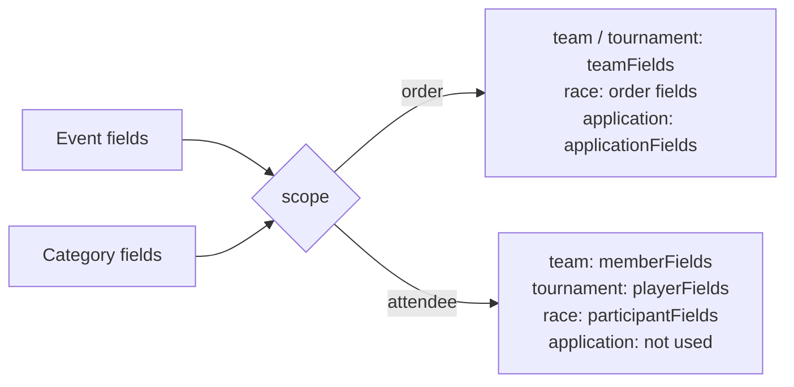

| Mode          | `scope: "order"` merges into                                          | `scope: "attendee"` merges into          |
| ------------- | --------------------------------------------------------------------- | ---------------------------------------- |
| `team`        | `teamFields`                                                          | `memberFields`                           |
| `tournament`  | `teamFields`                                                          | `playerFields`                           |
| `race`        | Order fields                                                          | `participantFields`                      |
| `application` | `applicationFields`, plus the chosen track category's order fields    | Not used: an application has no attendees |

Sample-data examples include dietary requirements, tasting track, discovery source, group name, passport number and student ID.

## Bundle tickets

A bundle is a separately priced category composed of existing single-ticket categories. It is not a mode.

```ts
{
  id: "two-day-general",
  name: "Day 1 and 2 General Entry",
  price: 500,
  originalPrice: 600,
  badge: "Save ৳100",
  bundleItems: [
    { categoryId: "day-1-general", quantity: 1 },
    { categoryId: "day-2-general", quantity: 1 },
  ],
}
```

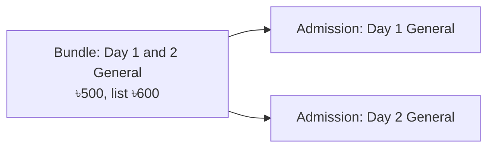

Buying one produces two admissions for ৳500 instead of ৳600. Included categories and quantities are shown in the UI; the cart admission count sums included tickets; the bundle price is charged once per bundle; original price and savings can be displayed; attendee forms are labelled by included category when individual details are required, and only quantity plus the lead form is needed when they are not. `bundleSize` remains only as a legacy fallback for old data.

## Cluster catalog cart

The full catalog cart contains:

- Selected category lines, each with a per-category total and a delete action
- Bundle-aware admission counts, excluding any line with `admits: false`
- A cart holding only non-admitting lines, which counts as full rather than empty
- One lead-attendee form: name, email, and Bangladesh phone with `+88`
- Event-level additional fields
- An optional donation block when `settings.donation` is present
- The order total and required-field validation before continuing

The desktop cart is viewport-scrollable. Mobile uses the same state in a bottom drawer, so switching layouts never requires re-entering anything.

## Registration state management

Registration state must live in a state manager, not in component-local `useState` passed through props. This is an architectural requirement, for four reasons the system already depends on:

- **The same state renders in two places at once.** The catalog cart appears in a desktop column and a mobile drawer.
- **The same state survives a layout change.** A user who fills the lead form and then opens a modal or navigates to a category page keeps what they entered.
- **Wizards span steps.** Team, race and tournament flows collect data across three or four screens with backward navigation.
- **Donation appears in several placements.** One amount can be edited from a cart line, a lead form or a standalone page.

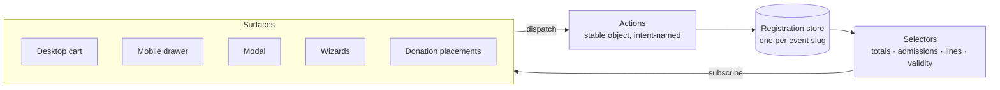

### Library

Zustand, as a vanilla store read through `useStore`. The stores are small, mostly flat and read from many components, which Zustand handles with the least ceremony. Do not add a second state library.

### Scope

One store per event registration session, keyed by event `slug`, so two events in two tabs never share a cart. It is created when a registration surface mounts and torn down on successful checkout or explicit reset.

### What belongs in the store

| In the store | Local to the component |
| --- | --- |
| Selected categories and quantities | Input focus and blur |
| Lead attendee details | Dropdown open and closed |
| Per-attendee records | Whether a validation error is displayed |
| Team, roster and participant data | Catalog search query |
| Active wizard step and furthest step reached | Cluster filter selection |
| Donation amount, anonymity, dedication, recurrence | Drawer open and closed |
| Application draft answers | Transition and animation state |
| Applied coupon code | Scroll position |
| Waiver acceptance and its version | Attachment handles (`File` objects) |

### Derived values are never stored

Compute these in selectors. Storing them creates two sources of truth that drift as soon as a category is removed.

- Order total, per-category total, and savings against `originalPrice`
- Admission count: sums bundle contents, excludes lines with `admits: false`
- Line count: the separate question of whether the order holds anything
- The lowest price a visitor could actually pay, which no donation line sets
- Age category, from date of birth against `raceRegistration.ageCalculatedOn`
- Team, roster and substitute size validity against resolved minimums and maximums
- Whether the current wizard step is complete and the next reachable
- Effective donation configuration for a given placement

### Store shape

As implemented in `src/lib/registration-store.ts`. Four places differ from the first proposal, each with a decision entry below: one `CartLine` instead of two maps, answers typed as strings, attendee records keyed twice, and the application form holding its files itself.

```ts
export type CartLine = {
  amount?: number; // Set on an open-amount line; absent on a ticket
  categoryId: string;
  quantity: number;
};

type RegistrationState = {
  /* Selection */
  lines: Record<string, CartLine>;
  selectedCategoryId: string | null;

  /* People */
  lead: AttendeeRecord;
  attendees: Record<string, Record<number, AttendeeRecord>>;
  bundleAttendees: Record<string, Record<number, AttendeeRecord>>;

  /* Answers */
  orderFields: Record<string, string>;
  leadFields: Record<string, string>;

  /* Mode specific */
  team: TeamRecord | null;
  inviteCode: string;
  raceEntry: { distanceId: string | null; waveId: string | null } | null;
  tournamentEntry: {
    divisionId: string | null;
    freeAgent: boolean;
    seeding: string;
  } | null;
  roster: Record<number, RosterEntry>;

  /* Order level */
  donation: DonationEntry | null;
  couponCode: string | null;
  waiver: { accepted: boolean; version: string } | null;

  /* Flow */
  step: number;
  furthestStep: number;
};
```

`selectedCategoryId` sits beside `lines` instead of being derived from it, because selecting a category and buying it are different events: a team category is selected but priced by team size, and a bundle is selected before its dialog has settled a quantity.

Actions are a stable object held beside the store rather than inside its state, so reading them subscribes to nothing and a dispatch-only component never re-renders. Keep state flat where possible: nested objects are harder to update immutably and cause wider re-renders.

### Rules

- Components subscribe through selectors, never to the whole store. Changing one line's quantity must not re-render every other line.
- Every mutation is a store action. No component writes a nested field directly.
- Removing a category clears its dependent data in the same action: attendee forms, bundle attendee records and category field answers. This must not regress.
- Validation is derived on demand. Never store an `isValid` flag.
- Actions are named for user intent, not the mutation: `removeCategory`, not `setSelections`.

### Persistence

Session-scoped and in memory. A cart that survives reload is backend work (see Prototype boundary), so do not use `localStorage` as a substitute: it produces a cart that can outlive the inventory it claims to hold. Persistence belongs behind the same API layer as inventory reservation.

## Configuration combinations

The type system allows 2,688 raw combinations:

```text
6 templates × 7 layouts × 8 modes × 2 on-page × 2 individual-info × 2 cluster-filter
```

Use the compatibility rules below rather than treating each as a separate journey.

### Templates

Every template supports every mode and layout; choose the template only for the hero and details presentation.

| Template   | Best suited to                                         |
| ---------- | ------------------------------------------------------ |
| `hero`     | Large immersive event imagery.                         |
| `split`    | Balanced event copy and artwork.                       |
| `agenda`   | Conferences, schedules and professional events.        |
| `poster`   | Festivals, concerts and strongly visual campaigns.     |
| `campaign` | Fundraisers with a goal, a story and progress.         |
| `race`     | Marathons and other course-based participation events. |

### Layouts and modes

| Layout          | Recommended modes                           | Notes                                                                                                 |
| --------------- | ------------------------------------------- | ----------------------------------------------------------------------------------------------------- |
| `sidebar`       | `single`, `multi`, `team`, `invite`         | Compact registration beside the details on desktop.                                                   |
| `inline`        | All except `tournament`                     | Prominent registration without a sidebar.                                                             |
| `modal`         | `single`, `multi`, `invite`, `donation`     | The normal mode-specific form in a focused modal.                                                     |
| `catalog`       | `single`, `multi`, `race`, `tournament`     | `multi` gets the cart; other modes keep their form in the full-width area. Dhaka Cycling Challenge is the shipped `race` example. |
| `catalog-modal` | `single`, `multi`                           | The same mode-aware behaviour inside a modal.                                                         |
| `wizard`        | `race`, `tournament`, `team`, `application` | Full-page steps. The only layout that fits a roster or a long application.                            |
| `amount`        | `donation`                                  | Amount chips, custom input and optional campaign progress.                                            |

### Booleans

| Option                         | `true` when                                                                                 | `false` when                                                                                         |
| ------------------------------ | ------------------------------------------------------------------------------------------- | ---------------------------------------------------------------------------------------------------- |
| `onPageRegistration`           | Registration stays on the event page.                                                       | Registration moves to a separate route.                                                              |
| `collectIndividualInformation` | Every admission in a single-category order, or every bundle ticket, needs its own record.   | One lead attendee is enough.                                                                         |
| `showClusterFilter`            | At least one category has a `cluster` and users should filter by it.                        | No clusters, the filter is unnecessary, or the mode is `invite`, `application` or `donation`.        |

`showClusterFilter: true` does not create clusters. It only shows the filter when category data has values such as `cluster: "Day 1"`.

## Recommended presets

### Standard single-category registration

```ts
settings: createEventSettings({
  eventPageTemplate: "hero",
  registrationLayout: "sidebar",
  registrationMode: "single",
  onPageRegistration: true,
  collectIndividualInformation: false,
  showClusterFilter: false,
  status: "live",
}),
```

### Single-category registration with cluster filtering

```ts
settings: createEventSettings({
  eventPageTemplate: "split",
  registrationLayout: "sidebar",
  registrationMode: "single",
  onPageRegistration: true,
  collectIndividualInformation: false,
  showClusterFilter: true, // Categories must contain cluster values
  status: "live",
}),
```

### Multi-category registration with one lead attendee

```ts
settings: createEventSettings({
  eventPageTemplate: "poster",
  registrationLayout: "inline",
  registrationMode: "multi",
  onPageRegistration: true,
  collectIndividualInformation: false,
  showClusterFilter: false,
  status: "live",
}),
```

### Multi-category bundles requiring every attendee

```ts
settings: createEventSettings({
  eventPageTemplate: "hero",
  registrationLayout: "modal",
  registrationMode: "multi",
  onPageRegistration: true,
  collectIndividualInformation: true,
  showClusterFilter: false,
  status: "live",
}),
```

In `multi` mode, `collectIndividualInformation` affects composed bundle tickets. For an ordinary category where every admission needs its own form, use `single` with `collectIndividualInformation: true`.

### Clustered marketplace

```ts
settings: createEventSettings({
  eventPageTemplate: "hero",
  registrationLayout: "catalog",
  registrationMode: "multi",
  onPageRegistration: true,
  collectIndividualInformation: false,
  showClusterFilter: true,
  status: "live",
}),
```

### Individual registration for every attendee

```ts
settings: createEventSettings({
  eventPageTemplate: "split",
  registrationLayout: "sidebar",
  registrationMode: "single",
  onPageRegistration: true,
  collectIndividualInformation: true,
  showClusterFilter: true, // Optional; requires category clusters
  status: "live",
}),
```

### Team registration

```ts
settings: createEventSettings({
  eventPageTemplate: "agenda",
  registrationLayout: "sidebar",
  registrationMode: "team",
  onPageRegistration: true,
  collectIndividualInformation: false,
  showClusterFilter: false,
  status: "upcoming",
  teamRegistration: {
    minSize: 1,
    maxSize: 10,
    teamFields: [/* defaults for this event */],
    memberFields: [/* defaults for this event */],
  },
}),
```

Each team category can opt into the dedicated wizard:

```ts
{
  id: "team-standard",
  separateRegistrationPage: true,
  teamRegistration: {
    minSize: 1, // Overrides only this category's minimum
    memberFields: [/* replaces the event's member fields for this category */],
  },
}
```

### Invite registration on a separate page

```ts
settings: createEventSettings({
  eventPageTemplate: "agenda",
  registrationLayout: "modal",
  registrationMode: "invite",
  onPageRegistration: false,
  collectIndividualInformation: false,
  showClusterFilter: false,
  status: "live",
}),
```

### Race with distances and start waves

Distances are clusters, so `showClusterFilter` is what puts them on screen. Use `clusterSelection: "required"` when a runner must pick a distance before seeing anything.

```ts
settings: createEventSettings({
  eventPageTemplate: "race",
  registrationLayout: "wizard",
  registrationMode: "race",
  onPageRegistration: false,
  collectIndividualInformation: true, // Implied; stated for clarity
  showClusterFilter: true,            // The distances
  clusterSelection: "required",       // Pick a distance before anything lists
  status: "upcoming",
  raceRegistration: {
    ageCalculatedOn: "2027-03-14T00:00:00+06:00",
    allowWaveSelection: true,
    bibNameEnabled: true,
    estimatedFinishRequired: true,
    requireEmergencyContact: true,
    requireMedicalInfo: true,
    waiverHtml: "<p>...</p>",
    waiverVersion: "2027.1",
    waves: [/* ... */], // Omit where the organizer assigns waves itself
    ageCategories: [/* ... */],
    participantFields: [/* ... */],
  },
  donation: {
    prompt: "Add a donation to your entry",
    suggestedAmounts: [200, 500, 1000],
    allowCustomAmount: true,
  },
}),
```

### Tournament with divisions and rosters

```ts
settings: createEventSettings({
  eventPageTemplate: "agenda",
  registrationLayout: "wizard",
  registrationMode: "tournament",
  onPageRegistration: false,
  collectIndividualInformation: true, // Implied; stated for clarity
  showClusterFilter: false,
  status: "upcoming",
  tournamentRegistration: {
    rosterSize: { min: 5, max: 8 },
    substitutes: { min: 0, max: 3 },
    roles: ["Captain", "Player", "Substitute", "Coach"],
    nonPlayingRoles: ["Coach"], // Every name here must appear in `roles`
    playerDocuments: [
      {
        label: "Eligibility document",
        required: true,
        accept: ["application/pdf", "image/jpeg"],
        maxSizeMb: 5,
      },
    ],
    allowFreeAgents: true,
    seedingField: true,
    playerFields: [/* ... */],
  },
}),
```

### Application with payment after approval

```ts
settings: createEventSettings({
  eventPageTemplate: "split",
  registrationLayout: "wizard",
  registrationMode: "application",
  onPageRegistration: false,
  collectIndividualInformation: false,
  showClusterFilter: false,
  status: "live",
  applicationRegistration: {
    paymentTiming: "on_approval",
    capacity: 60,
    decisionBy: "2027-04-01T00:00:00+06:00",
    submissionClosesAt: "2027-03-15T23:59:00+06:00",
    reviewMessage: "The selection panel reviews applications every Monday.",
    applicationFields: [/* ... */],
    attachments: [
      {
        label: "Portfolio (PDF)",
        required: true,
        accept: ["application/pdf"],
        maxSizeMb: 10,
      },
    ],
  },
}),
```

### Donation-only campaign

```ts
settings: createEventSettings({
  eventPageTemplate: "campaign",
  registrationLayout: "amount",
  registrationMode: "donation",
  onPageRegistration: true,
  collectIndividualInformation: false,
  showClusterFilter: false,
  status: "live",
  donation: {
    prompt: "Support the flood relief fund",
    suggestedAmounts: [500, 1000, 2500, 5000],
    allowCustomAmount: true,
    allowAnonymous: true,
    allowRecurring: true,
    dedication: true,
    taxReceipt: true,
    minAmount: 100,
    campaign: {
      id: 1,
      name: "Flood Relief 2027",
      goalAmount: 2500000,
      raisedAmount: 1180000,
      showProgress: true,
      showDonorWall: true,
    },
  },
}),
```

### Ticketed event with an optional donation

```ts
settings: createEventSettings({
  eventPageTemplate: "hero",
  registrationLayout: "sidebar",
  registrationMode: "single",
  onPageRegistration: true,
  collectIndividualInformation: false,
  showClusterFilter: false,
  status: "live",
  donation: {
    prompt: "Add a donation to your order",
    suggestedAmounts: [100, 250, 500],
    allowCustomAmount: true,
    minAmount: 50,
  },
}),
```

## Combinations to avoid

- `showClusterFilter: true` with no category `cluster` values: valid, but has no visible effect.
- `showClusterFilter: true` with `invite`, `application` or `donation`: those forms do not select categories.
- `collectIndividualInformation: true` in `team`, `tournament`, `race`, or non-bundle `multi`: no additional effect. The first three already imply it.
- `modal` or `catalog-modal` with `onPageRegistration: false` when a modal is expected: the page shows a separate-page CTA instead.
- `modal` with `tournament`: the roster step does not fit a modal.
- `amount` with any mode other than `donation`: there is no amount to select.
- `application` with `onPageRegistration: true`: valid, but the status route makes a separate page the sensible default.
- A category with `isDonation: true` that also has `bundleItems` or `separateRegistrationPage`: donation lines do not compose and have no dedicated page.
- `admits: true` on a donation category: it would inflate the admission count and issue a QR ticket for a gift.

## Current sample configuration

Generated by reading `src/constants/event-details-data.ts`, not written from what events were meant to be. The hand-maintained table this replaced disagreed with the data three times: Art Walk's individual information, Food Carnival's cluster filter and mode, and Startup Demo Night's layout (listed as `modal`, shipped as `sidebar`).

**Regenerate it; never edit a cell.** Read `EVENT_DETAIL_SLUGS` → `getEventDetail` → `settings`, and `getEventRegistrationAvailability(event)` for the State column, then diff against the rows here. Check the row count against the number of detailed events before pasting: a short table looks exactly like a correct one. This table once carried 14 rows against 17 events, missing the three that demonstrate `ended`, `paused` and `cancelled`, and nothing read wrong.

`Required` in the cluster column means `clusterSelection: "required"`.

| Event | Template | Layout | Mode | On-page | Individual info | Cluster filter | State | Also demonstrates |
| ----- | -------- | ------ | ---- | ------- | --------------- | -------------- | ----- | ----------------- |
| Aarong presents FIFA World Cup 2026 Watch Party | `hero` | `modal` | `multi` | Yes | No | On | `open` | the only `modal` layout, bundle, a spent notify-me window, `soldOutText`, a flag with stock |
| Stage Laughs: Live Comedy | `hero` | `sidebar` | `single` | Yes | No | Off | `pre_registration` | notify me, minimal |
| Creator Tech Expo | `agenda` | `sidebar` | `team` | Yes | No | Off | `open` | category pages, every category routes out |
| Indie Friday Sessions | `poster` | `sidebar` | `multi` | Yes | No | On | `open` | bundle |
| Rooftop Food Carnival | `hero` | `sidebar` | `multi` | Yes | No | On | `open` | bundle |
| Old Dhaka Art Walk | `split` | `sidebar` | `single` | Yes | Yes | Off | `open` | category pages |
| Startup Demo Night | `agenda` | `sidebar` | `invite` | No | No | Off | `open` | separate event-level page |
| Dhaka Marathon 2027 | `race` | `wizard` | `race` | No | Yes | Required | `open` | distances as clusters, category pages, sold-out categories |
| Here I Am | `poster` | `sidebar` | `single` | Yes | No | Off | `open` | donate action, the only theme, the only `to_be_announced` tier |
| City Football Cup | `agenda` | `wizard` | `tournament` | Yes | Yes | Off | `open` | — |
| Tickify Residency Programme | `split` | `wizard` | `application` | No | No | Off | `open` | — |
| Flood Relief Fund | `campaign` | `amount` | `donation` | Yes | No | Off | `open` | donate action, no categories |
| Dhaka Cycling Challenge | `race` | `catalog` | `race` | Yes | Yes | On | `coming_soon` | start waves, category pages, `comingSoonText` |
| Winter Charity Gala | `hero` | `catalog` | `multi` | Yes | No | On | `pre_registration` | donation lines, bundle, pre-register with early access |
| Product Summit Dhaka | `agenda` | `sidebar` | `single` | Yes | No | Off | `ended` | — |
| Design Systems Lab | `hero` | `sidebar` | `single` | Yes | No | Off | `paused` | — |
| Riverfront Culture Fest | `split` | `sidebar` | `single` | Yes | No | Off | `cancelled` | — |

### What the sample events cover

Creator Tech Expo and Old Dhaka Art Walk show dedicated category pages on an inline flow; Dhaka Marathon and Dhaka Cycling Challenge do the same for a race, one staged behind distances and one from a catalog. They are also the two race shapes: the marathon assigns waves itself, the cycling challenge offers three. Startup Demo Night is the separate event-level page. Winter Charity Gala is the only event with donation lines beside real tickets, and Flood Relief Fund the only one with no categories.

Three events carry `preRegistration`, spanning the module's range. Stage Laughs is the minimum: a `cta` and nothing else. Winter Charity Gala is the maximum: a capacity, a paid early-access window half an hour before general sale with `eligibility: "selected"`, two notification channels and three questions beside its existing event-level `registrationFields`, which proves the two do not collide. The Watch Party's window has closed and its sale has opened, so it reads `open` and the module has removed itself, the case the other two cannot show. It is also the only `modal` event; it sat `upcoming` with registration closed for a while, so the modal it exists to demonstrate could not be opened.

Dhaka Cycling Challenge is announced *without* the key: `isRegistrationOpen: false` plus a `comingSoonText`, proving that an organizer who only wants to say "entries open later" needs a sentence, not a config object. The Watch Party's Skybox Table is the only category flagged sold out while stock remains, the shape `remaining` alone would call available and the reason the store checks all three flags.

Here I Am carries the two newest features. Its `theme` is `#9a0000` on the `display` face: the only themed event, so the only one exercising the scoped palette, derived neutrals and drawn edge. That accent needs its hairline on dark, which `assertEventThemeContrast` reports at `warn`. Its General seat is `status: "to_be_announced"` with 34 seats left and `soldOut: false`, so nothing about it could be mistaken for sold out, and the event still reads `open` because Supporter seat is on sale beside it.

### The drift these events used to show

Three events once contradicted their own copy. **All three drifted the same way: the table described what an event was meant to be, and the data described what shipped.** Art Walk claimed every place was registered to a named attendee but collected only a lead. Food Carnival explained its session clusters but hid the filter, and sold one category at a time while its copy invited mixing. Startup Demo Night was listed as `modal` and shipped as `sidebar`.

None was a coding error; each was a hand-maintained table falling behind its file. The fix is reading the table off the module, plus `approved-settings.test.ts`, which fails when an answered value moves.

## Primary implementation files

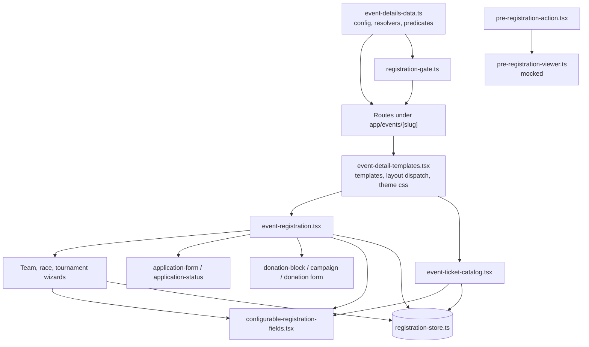

| File | Responsibility |
| ---- | -------------- |
| `src/constants/event-details-data.ts` | Event, ticket, bundle, field, mode and template configuration, plus the resolvers and predicates that read it, including `getCategoryStatus`, `resolveEventTheme` and the theme assertions. |
| `src/constants/events-data.ts` | Browse listings, including standalone entries for events with no home-page slot. |
| `src/lib/registration-store.ts` | The registration session: one store per slug, its actions and selectors. Also records the decision about a cart outliving its event's availability. |
| `src/lib/registration-gate.ts` | The presentational guard the four registration routes call; adds the category dimension. |
| `src/lib/pre-registration-viewer.ts` | The one read of pre-registration viewer state, mocked. One file to point at the real endpoint. |
| `src/components/events/detail/configurable-registration-fields.tsx` | **The shared field renderer.** `DynamicRegistrationFields` is the component; `RegistrationField` is the type. Every form uses it by name. |
| `src/components/events/detail/event-detail-templates.tsx` | Template registry, layout dispatch, the shared surfaces carrying the registration and donate actions, and `eventThemeCss`. |
| `src/app/globals.css` | The `--color-event-*` aliases and fallbacks, `.event-accent-edge`, and the `--event-font` chain. A theme is only ever custom properties; this is where they mean something. |
| `src/components/events/detail/event-registration.tsx` | Single, multi, team and invite forms, per-attendee and bundle forms, and the branches that keep race, tournament, application and donation off the shared shell. |
| `src/components/events/detail/event-ticket-catalog.tsx` | Catalog search, cluster filtering, cart, lead form, mobile drawer, bundle and donation lines. |
| `src/components/events/detail/individual-category-registration.tsx` | Dedicated category attendee form. |
| `src/components/events/detail/team-registration-wizard.tsx` | Team, participant and review wizard. |
| `src/components/events/detail/race-registration-wizard.tsx` | Distance confirmation, wave, entrants, waiver and review. |
| `src/components/events/detail/tournament-registration-wizard.tsx` | Team or free agent, division, roster and review. |
| `src/components/events/detail/application-form.tsx` | Application submission and attachments. |
| `src/components/events/detail/application-status.tsx` | Every application status, and the payment offer where one is owed. |
| `src/components/events/detail/donation-block.tsx` | The amount selector shared by all placements. |
| `src/components/events/detail/donation-campaign.tsx` | Goal, progress and donor wall. |
| `src/components/events/detail/event-donation-form.tsx` | The form behind `/donate`, for placements 1 and 2. |
| `src/components/events/detail/pre-registration-action.tsx` | The pre-registration CTA, its dialog, and the client boundary where clock and viewer meet. |
| `src/app/events/[slug]/page.tsx` | Event detail route. |
| `src/app/events/[slug]/register/page.tsx` | Separate registration route. Excludes modes with their own routes, then asks `getRegistrationGate`. |
| `src/app/events/[slug]/register/[categoryId]/page.tsx` | Dedicated category route, switching four ways on mode. Gated on event *and* category. |
| `src/app/events/[slug]/apply/page.tsx` | Application submission route. Gated; the one caller of `getApplicationAvailability` outside the event resolver. |
| `src/app/events/[slug]/application/[reference]/page.tsx` | Application status route. The only unbounded segment, so the only one rendered at request time. |
| `src/app/events/[slug]/donate/page.tsx` | Donation route. Gated: a campaign that has not launched should not take money. |
| `scripts/theme-sweep.ts` | Walks a rendered event subtree over the DevTools protocol and flags any *computed* colour that should be the theme's. |
| `scripts/theme-sweep-cdp.ts` | The headless-browser plumbing, kept separate because the walk is the part worth reading. |

### The checks, and why each exists

Every one was added after something specific got through.

| File | Catches |
| ---- | ------- |
| `src/test/harness.ts` | Renders components with a real DOM under `bun test`. Its limits are in the file: no CSS, so breakpoints are read from class lists; no Next runtime, so `next/image` throws and no test renders shipped event media. |
| `src/test/fixtures.ts` | Builds events and categories for paths the shipped data leaves quiet, so nobody edits a shipped event to exercise a branch and forgets to revert it. `withSettings` makes the safe clone the short path, after hand-rolled spreads broke a check three times. |
| `src/lib/registration-store.test.ts` | Two surfaces disagreeing about one order; a removal leaving attendee records or answers behind. |
| `.../event-ticket-catalog.test.tsx` | Cart and drawer rendering different orders; placement 3 offering a quantity; a donation-only order unable to reach checkout. |
| `.../team-registration-wizard.test.tsx` | A step losing what an earlier step collected. It caught `editTeam` defaulting size to one and collapsing the roster on the first keystroke. |
| `.../race-registration-wizard.test.tsx` | Age category computed from the browser's calendar; a full wave closing a distance still open. |
| `.../field-coverage.test.tsx` | A field declared in any array, at either scope, that nothing renders. Reads shipped events and models merge-versus-replace. |
| `.../registration-surface.test.tsx` | A mode with no event-level surface; a donate action missing from a template or layout. Both records are kept total by the compiler. |
| `.../surface-semantics.test.tsx` | A shared surface rendering something inappropriate: "Tickets from" on an event selling none, "Free" on a priced seat, a stock count on a stockless line, two donate actions, a stepper or configurator on an off-sale line, a to-be-announced tier dressed as sold out. |
| `.../donation-block.test.tsx` | An amount reaching the total but not its placement; a placement rendering the wrong control. |
| `.../application-status.test.tsx` | A status with nothing to show; a payment offer in the wrong state. The coverage net cannot reach this page. |
| `.../configurable-registration-fields.test.tsx` | A field format whose control has no accessible name. Total over nine formats plus default, each naming its mechanism. |
| `src/constants/approved-settings.test.ts` | A sample value drifting from an answered decision. Each assertion carries its reason. |
| `src/constants/pre-registration.test.ts` | The pre-registration acceptance list: eight existing states unchanged, the early-access boundary both ways, an unlaunched campaign taking money. Every case passes `now` explicitly because fixtures use 2027 dates. |
| `src/lib/registration-gate.test.ts` | A route drawing a form for a blocked state; an off-sale category on an open event, including a refusal phrased as the wrong kind of closed. Each case names its URL. |
| `.../event-theme.test.tsx` | A theme applying where it should not; an unthemed event changing because the feature exists; an excluded token inside a themed block; a portaled dialog losing its palette. |
| `src/constants/theme-surfaces.test.ts` | `THEME_SURFACES` drifting from the two `globals.css` values it copies. |

(`...` is `src/components/events/detail`.)

### `bun run verify`

`scripts/verify.sh` (`bun run verify`, add `--build` for the production build) runs typecheck, tests, lint and prettier together and reads every signal, not just exit codes. It is scoped to tickify-web; the workspace keeps its own gates at the root.

It exists because four misses came from reading one signal as success: lint warnings exit zero; a test file that throws at collection still reports `0 fail`; a shell chain whose first command fails still prints its second command's success message; a build can exit zero having produced nothing useful.

Two more were found in the script itself. Its unused-symbol check grepped for `tickify-web.*never used`, but eslint prints the path on a separate line, so every `0 unused` was vacuous and two dead imports sat under it. And it named `docs/*.md` while running from a directory where `.prettierignore` (which excludes every `docs` directory, because that prose is hand-formatted) was out of view, so it either did nothing or reformatted what it should leave alone.

**A check that finds nothing and a check that looks at nothing print the same word.** That is why the list of what `verify` reads lives here as well as in the script header.

## Implementation decisions

The sections above say what is built; these say what was decided and what the alternative would have cost. Several began as departures from an earlier draft of this document, since brought in line with the code, so an entry that reads like a correction is a decision whose losing option was once written here.

**Every entry states its reasoning, not only its conclusion.** Several were reached by getting them wrong first: a coverage net that counted replaced field arrays and cried wolf on working code, a rule keyed on "any category routes out" that would have removed Old Dhaka Art Walk's checkout, a donation card offering a quantity where the decision said amount. A conclusion without its reason is what the next person reverses because it looks inconvenient.

Entries are grouped by area.

### Registration store and data shape

#### Field answers are `Record<string, string>`

The first draft used `Record<string, unknown>`, with application answers held beside them. Answers are strings throughout because `DynamicRegistrationFields` and `requiredFieldsComplete` are string-keyed and the latter calls `.trim()` on every value. Widening to `unknown` would force either a second renderer or casts at every read, and both are ruled out.

#### One `CartLine`, not two maps

The alternative was `selections` beside `donationLines`, keyed alike and updated in parallel. There is one line type instead:

```ts
type CartLine = { amount?: number; categoryId: string; quantity: number };
// total = line.amount ?? category.price * line.quantity
```

Winter Charity Gala puts donation and ticket categories in one removable list, in both cart and drawer, so one list wants one type. Donation lines are pinned to `quantity: 1` inside the add and update actions, and no stepper renders on an `isDonation` card: three of a variable amount equals one of three times it, and two ways to say the same thing can disagree.

#### Attendee records are keyed twice; files stay out of the store

`attendees` and `bundleAttendees` are `Record<categoryId, Record<index, AttendeeRecord>>` rather than one map with composed keys. Two categories can hold the same index, and removing a category must take exactly its own records, which is one `delete` on the outer key instead of a scan. Bundles get a separate map because an included ticket's index inside a bundle is not an admission index in the order.

Attachment handles are `File` objects and stay in component state. They cannot be serialised or survive reload, and putting them in a store whose contract is "session data other surfaces read" would promise durability nothing here has. The application form is one surface, so nothing else needs them.

#### Field-answer clearing is scope-aware, and the catalog splits on write

Two halves of one rule. `reachableFieldIds` resolves surviving answers per scope: `orderFields` against order questions, `leadFields` against attendee questions. A single union would keep an order answer alive because an attendee question happens to share its id. No current event reuses an id across scopes, so nothing visible objects; modes that collect both make it matter.

The catalog lead form still renders all event questions as one list. To keep that appearance and the separation, it merges both maps for reading and splits them again on write by each field's scope. Writing everything to `orderFields` would let an attendee answer be dropped by the order-scoped check as soon as a category is removed.

#### Registration state is seeded from the event

`initialState` is a function of the event, not of the mounting component. The surfaces it replaced seeded themselves on mount (the single form opened with one ticket of the first available category, the team form at the minimum size), and with a shared session, per-mount seeding would let the second surface to mount wipe the first one's work. Invite mode seeds a line too, which looks odd but preserves old behaviour exactly: the form defaulted quantity to one for every mode, and the modal's ticket-count shortcut reads that number.

### Mode configuration

#### Resolvers return `null` when configuration is missing

`resolveRaceRegistration` and `resolveTournamentRegistration` return `Config | null`, because no honest default exists for a missing `waiverHtml` or `rosterSize`. A mode without configuration reports `state: "unavailable"` through `getMissingModeConfigKey`, so every surface draws its closed-event treatment instead of a blank panel or a crash. `reportMissingModeConfig` names the key on the console outside production, deduped per `slug:key` because availability is read several times per render.

`resolveTournamentRegistration` takes an *optional* category, because the event-level wizard needs defaults before a division is chosen and a free agent never chooses one. `resolveDonationConfig` drops `campaign` when resolving for a category, because a campaign belongs to the event.

#### `AttachmentSpec`, and no `requirePlayerDocuments`

The spec is `AttachmentSpec`, not `ApplicationAttachment`, and is shared by applications and rosters: an eligibility document and a portfolio differ in content, not in what the form needs. The tournament config uses `playerDocuments?: AttachmentSpec[]` instead of `requirePlayerDocuments: boolean`, with non-empty presence as the flag, because a boolean beside a spec array can silently disagree.

#### `nonPlayingRoles`

The pricing rule existed only as prose first, which is a rule nothing can honour. `assertNonPlayingRolesExist` throws outside production when a name is missing from `roles`, because a subset array drifts, and the drift shows up as a coach being charged.

#### Age is computed on the Dhaka calendar

`getAgeOn` compares calendar dates rendered in `Asia/Dhaka`, not local `getMonth`/`getDate`. Local parts give a runner in another time zone a different age from the server's. Dividing elapsed milliseconds by a year is wrong by a day for about a quarter of entrants because of leap years, which hits exactly the people one day from a category boundary. Both were found by failing tests.

#### Standard entrant fields live in the mode, not the data

Date of birth, gender, shirt size, emergency contact and the rest are built by the race wizard, not listed per event. They are the mode's own requirements: an organizer who forgets date of birth still needs it, because age category is derived from it. `participantFields` adds to them.

#### Eligibility questions use `registrationFields`, never `participantFields`

A category needing the standard questions plus one of its own sets `registrationFields`, which merges. `participantFields` replaces the standard set wholesale, so a student-ID question placed there would discard date of birth, gender and emergency contact, and the loss would surface two screens later as a missing age badge. Reserve `participantFields` for a distance that genuinely asks a different set.

Both scopes reach the wizard: attendee questions join the per-runner set; order questions are asked once on the confirming step under "About this entry" and gate it. Only the attendee half worked until this was tested.

#### Waves never close a distance

`waveHasRoom` is asked only about a wave. A full wave narrows the start times on offer and nothing else. A bug here would not look like one, because a disabled distance beside a full wave reads as a sold-out race, so the tests assert the distance stays enterable when one wave, and when every wave, is full.

#### Distances are clusters; categories are eligibility

A race distance is a cluster, and its categories are who may enter and at what price: General, Student, Member, Member Elite, Foreigner, each with its own page and sold-out state. `TicketCluster` carries `startsAt` and `cutOff` because a distance starts and closes once regardless of who runs it; `resolveCluster` reads them. The relay is a fourth cluster with one category and carries the only category-level `raceRegistration` override; its `maxPerOrder` matches the roster size so the two limits cannot disagree.

#### The race wizard's first step confirms rather than asks

Most races set their own waves, so with wave selection off the first screen would be empty. It shows the distance, start time, cut-off, entry type and fee instead: real facts before anyone types entrant details. One wizard shape, four steps, with or without a wave choice.

#### A free agent is a different shape, not an empty one

A free agent is one person joining a pool, with no team and no roster. The wizard drops the roster step and renames its steps (Entrant, Division, Review). A progress bar counting a screen nobody sees lies about how much is left.

#### Tournament runs its own surface at event level

The division is chosen inside the wizard and a free agent chooses none, so there is no category list and no lead attendee at event level. The mode returns its wizard before the shared shell instead of branching inside it. The same component serves a division's page, arriving with the division chosen.

#### No cluster-level fields

A distance's categories sometimes want the same question, and there is nowhere to put it once. The repetition is accepted. A third merge level would add another source to a merge already varying by scope and by event-versus-category, and clusters are matched by name, so hanging field arrays off a string match would make a loose link load-bearing. A question common to every category in a distance is usually common to the event, where `event.registrationFields` already merges. Today the repetition is one field id across four categories.

### Applications

#### An application track is a category

Every other mode varies questions by category, and applications already carried a category nothing read. A track has a price payable on approval, a capacity and a description, which is a category. A parallel `tracks` shape would be a second word for the same thing; `nonPlayingRoles` beside `roles` shows what that costs.

**One track is context, not a choice.** A chooser with one option is an empty wizard step. With one category the form states what is being applied for and merges its questions silently. Only order-scoped category questions merge, because applications have no attendees.

#### Programme capacity and track allocation are different numbers

Programme `capacity` caps the whole; a track's `remaining` allocates within it, so Photography can close while Film stays open. Two numbers describing one pool drift silently (sixty places advertised, tracks adding to ninety), so `assertTrackCapacity` throws outside production. Both stay presentational; capacity is verified server-side.

#### Application capacity is presentational

`applicationRegistration.capacity` is never checked on the client. A browser cannot see applications it did not submit, so any count it derives under-reports. The `full` state exists for the API to return.

#### What the client owes for payment on approval

Three answers, none forced by the types. **The status page does not re-render the submission**: it has only the reference, and reading answers from the session store would work in a demo while lying about the mechanism. **An approved applicant cannot edit**: changing an accepted application invalidates the acceptance, so editing belongs to resubmission after rejection. **Resubmission is offered only from `rejected` and `withdrawn`**: a waitlisted application is still under consideration, and a second one would be two records for one person. Payment is offered in exactly `approved` and `payment_pending`. Both rules are asserted for all nine states.

#### The reference segment is the first unbounded one

Every other dynamic segment is enumerated in `generateStaticParams`. A reference is issued at submit, so that route renders at request time and carries `robots: { index: false }`, since the reference is its only guard. The status comes from a query parameter, which makes the flow previewable by changing one value and is why the page must never be treated as authoritative.

#### An application is not a purchase, and `/register` does not claim it

`registrationHref` sends application events to `/apply` and donation events to `/donate`. `/register` excludes both and 404s them, because it rendered the ticket form for a selection those modes never make, and `residency-programme/register` was being prerendered before this was caught. `EventRegistration` gained an application branch for the same reason.

### Donation

#### A donation-only order is a valid order

Giving without attending is real, and placement 3 exists so a support line stands beside tickets as its own thing. The Gala's FAQ already promises it: support lines are open to anyone and issue no ticket. It is a product rule, and until now it held only by accident of what the guards counted.

**Emptiness and validity are a count of lines; admissions are a count of people.** `selectLineCount` sits beside `selectAdmissionCount` instead of replacing it, because repurposing the second would silently change the "N admissions" figure everywhere. The Continue button, lead form, mobile cart bar, drawer and the modal's jump-to-form shortcut all keyed on admissions, so a donation-only order left them dead; they key on lines now. One piece of copy changed: an order holding lines and admitting nobody reads "Support only, no admission" instead of "0 admissions".

An open-amount line has a third state: clearing the amount zeroes the line rather than removing it, so the order holds something carrying neither a person nor a taka. Its message comes from `donationAmountError`, the rule the donation block already shows, not a second test. This changes a shipped event's behaviour: a ৳300 gift to a Gala line advertising "gifts start at ৳1,000" used to be accepted and is now refused, because the alternative was a cart contradicting the card above it.

Neither failure disables the button. A control that cannot be pressed and does not say why is the same defect as an anchor pointing at nothing, so the guard runs on press and names what is missing.

#### Placement 3 offers an amount, never a quantity

A donation category renders suggested chips and a free field where a ticket renders a stepper. The store pins the line to one unit; the card never offers the choice.

#### The sidebar surface would still step a donation line

`event-registration.tsx` decides `showQuantity` from `!category.separateRegistrationPage`, so a donation line there gets a stepper: the placement-3 defect fixed in the catalog, surviving next door. Nothing ships through it, because the Gala uses the catalog. Left alone deliberately: removing the stepper would leave a card offering nothing, and placement 3 outside the catalog has never been designed. That is a decision for when an event needs it.

#### The donor wall has data of its own

`showDonorWall` turned the wall on with nothing to show, the same gap as `nonPlayingRoles`. `DonationDonor` fills it, with `anonymous` keeping a gift in the total while showing "A private donor". `TODO(api)`: the real wall is a paginated page of recent gifts from the backend; these entries only give it something to render until then.

#### The donation block holds no state, and neither does the clock

The block appears in several placements and only its caller knows which, so it takes its answer as a `value` prop and reports changes upward. `donationAmountError` is exported so a caller can block its own submit on the same rule the block displays; two copies of the minimum would disagree the first time one moved. The campaign panel takes `now` as a required prop, because a clock read at render gives different answers either side of hydration and lint rejects it.

### Surfaces, status and accessibility

#### The donate action lives in the shared surfaces, not the templates

Templates do not own the page's calls to action. Every template routes through one layout dispatcher, and the layout plus `onPageRegistration` picks which of three surfaces carries them: registration panel, summary card, or separate-registration card. So the donate action is wired into those three, and guarded by records the compiler keeps total over `EventDetailTemplate` and `RegistrationLayout`. The test asserts the outcome (a donate link with the right href), not the wiring.

The guard exists because the action shipped as dead code: written, described in a commit message, never called. It typechecked and built. Lint warned, and warnings exit zero. Three rounds of mutation were needed: looping templates alone covered one site of three, adding layouts covered two, and the third only appears on a non-hero template with registration on its own page. Each site is now checked by deleting it and watching the suite fail.

#### A surface that only links out has no order to place

When every on-sale category has `separateRegistrationPage`, the event-level surface is a menu with no selection and no order, so it offers no continue action. `everyCategoryHasItsOwnPage` decides this; the marathon is the case. It is "every", not "any": Art Walk routes one of two categories out and keeps the other inline, and an "any" rule would remove its checkout. It keys on categories, not mode, because the shape decides it.

#### Clusters filter, or they gate

`settings.clusterSelection` decides. A gated cluster with nothing on sale cannot be opened, and its tab says which kind of closed: "Sold out", or "To be announced" where one entry inside is pending. **Ask whether the clusters are stages of one choice or facets of a browse.** This is deliberately not keyed on mode: the festival is `multi` like the Gala and wants staging where the Gala does not.

#### The event-level surface is the part that gets forgotten

`EventRegistration` branches on mode, and a mode with no branch falls through to the lead form, rendering a plausible page that asks for a name where nothing can be chosen. That shipped once: the race wizard was built while the distance list was not, so fourteen distances rendered as none. `registration-surface.test.tsx` now holds one entry per mode in a compiler-total record, each asserting something only that mode's selection produces. Its first version asserted on cluster tabs, which render either way, and passed against the bug it was written for, so each assertion is now verified by removing its branch.

#### A sold-out line is coloured whole, and its control slot is empty

A chip was too quiet. A reader scanning eight rows reads edges and fills, not 10px captions, so the state deciding whether a line can be bought colours the whole card: destructive tint and edge, name in the same hue. That branch sits ahead of `selected`, which costs nothing because nothing unavailable can be selected. The control slot is empty rather than greyed: a disabled stepper still reads as an affordance, and a row saying "Sold out" beside a button argues with itself. `BundleControl` lost its `disabled` prop with it. Badges mute with the name, because an accent chip says "look at this one" about something nobody can buy. The tests changed "disabled" to "absent" and still assert the open line beside keeps its controls.

#### A refusal has to name which refusal it is

Saving a sold-out bundle once announced "Bundle details saved — 1 × Skybox Table is ready" over an order reading "0 admissions · Free": the session had refused the line and the toast fired anyway. So a surface asks the predicate before announcing, and anything that turns a refusal into words asks for the status. **A predicate is safe to share; the copy over it is not.** Two layers agreeing something is refused says nothing about their agreeing why.

#### Status moved to its own tokens so the chips could be themed

`--muted` and `--secondary` were excluded because `statusTone.upcoming` filled with `bg-secondary` and the StatusPill fell back to `bg-muted` for completed, ended and postponed events. Theming the chips would have repainted a status pill in brand colour. Extracting `--status-upcoming` and `--status-neutral` let both come off the list. **An exclusion list states what a token is used for, so a token doing two jobs must be split before either job can move.** `--border` stayed themeable because status uses it as a hairline, and a hairline is chrome.

#### The modal is outside the page it belongs to

Two failures, both invisible from the page behind. The theme never reached the dialog, because it is portaled outside the themed wrapper, so a themed event opened an unthemed modal in the wrong typeface; the fix is the attribute, not a palette copy. And "Continue to form" scrolled to the form, then set `aria-hidden` and `tabIndex={-1}` on the button still holding focus, so the next Tab restarted at the top of the dialog. It now hands focus over and hides nothing while focused, and it sits where a skip link belongs instead of as tab stop 21 of 22, behind the list it was meant to skip. The test asserts both halves: the dialog is outside the wrapper, and it carries the attribute anyway.

#### Participant inputs are named per participant

The team wizard hand-rolls its participant inputs and had only placeholders: 45 unlabelled fields on an eleven-person roster. Labels now name the person ("Full name for participant 3"), because eleven identical labels are a list a screen reader cannot navigate. The step-transition tests address inputs by accessible name, so removing labels fails a test.

#### Gender and T-shirt size are radio, not select

Both are "important visible choices with few options", this document's own criterion for `radio`. Gender has three options and feeds the age category shown beside it; hiding it in a popup would hide why the category changed. Sizes are six options of three characters or fewer and fit two columns. Decided twice, once while the `select` still lacked an accessible name and again on the merits after the fix; both reached the same answer.

#### The select's accessible name comes from the library

`Select.Trigger` is a button, so a `label` element cannot name it, and the adjacent `span` named nothing. Base UI's answer is `Select.Label` inside `Select.Root`, wiring `aria-labelledby` to the trigger; it renders as a `span` so the header stays phrasing content. Five shipped fields across four events use `select`, so this was reachable in production data.

The asymmetry left behind is stated so it does not look like an oversight. Only `select` is named by its label alone. Other formats are named by a `label` that also contains the required/optional badge and help text, so a text field reads "Nationality Optional". Nothing is lost, since required fields also carry `required`, but the name is noisier than it should be. Moving the badge behind `aria-hidden` and help text to `aria-describedby` would fix all nine formats at once; it is a separate change to a shared surface and is not made here.

#### The shared field renderer

The renderer is `DynamicRegistrationFields` in `configurable-registration-fields.tsx`; `RegistrationField` is the type. Earlier drafts confused the two and left the file out of the implementation table.

### Coverage and testing

#### One check for the whole class: declared fields must render

Five bugs were one bug: **configuration the type system accepts and the render path never reads.** A field with a scope no wizard rendered, a mode with no event-level surface, an action with no call site. Each was valid and silent, and none broke a build.

`field-coverage.test.tsx` covers the class. It reads what each shipped event declares across every field array and both scopes, walks the surface through every step, and asserts each field appears somewhere it can be answered. It does not care which step holds a field, so moving one is fine and rendering it nowhere is not. Steps are driven through the store, so a blocking validation rule cannot hide a field.

The enumerator must respect the resolution rules. Its first version counted both event and category `teamFields` and reported three phantom absences, because a category array replaces the event's wholesale. A net that cries wolf is a net people learn to ignore. Two limits are stated in the file: matching is substring-based, and coverage is bounded by what sample data declares.

#### The net had to learn about on-page divisions

It listed only categories with `separateRegistrationPage`, which skipped every division of an on-page tournament, so City Football Cup contributed nothing while appearing covered. Where no category routes out, it now walks them all. Its three merge paths are each exercised by shipped data: Under-19 asks an order-scoped safeguarding contact, Women's Division an attendee-scoped player ID.

#### The net did not cover tracks, and saying so was the fix

`CATEGORY_SURFACES.application` is `null`, so the per-category loop skips applications, which is also why the Residency Programme once contributed zero assertions. `null` stays correct, because an application has one surface and no per-category route; the standalone block now enumerates track questions. This was the fifth time checking what a guard asserts, rather than trusting it, found the gap.

#### What the coverage net cannot see

The status page has nine states driven by a query parameter against a record that does not exist, so there is nothing to walk. `application-status.test.tsx` asserts them directly. The application form is covered by a standalone block, because an application has one form and no categories.

#### Two kinds of drift, and only one is caught

Most gaps were **declared and silent**, which the coverage nets and total records catch. Placement 3 was the opposite: the code did something a decision **forbade** (a stepper on a donation card), and the test asserted the wrong behaviour, so the suite was green and the code wrong. Coverage nets check that declared things render, not that rendered things were agreed.

`approved-settings.test.ts` catches drift in *data*. Nothing catches drift in *behaviour*, and a test written from the code will pin the mistake. The defence is writing the assertion from the decision, which is why the placement-3 test runs against Winter Charity Gala and states that a donation card offers an amount and never a quantity.

**A green test is evidence that the code does what the test says, and nothing more.**

#### Approved settings are asserted, not trusted

Some sample values exist because a question was answered: City Football Cup on-page, Art Walk collecting individual information, the marathon staging clusters and carrying no donation. One drifted: the cup was committed with `onPageRegistration: true` and the working tree later held `false`, cause never found. That is the argument for asserting. The test pins only values with a recorded reason, each assertion carrying it; pinning every setting would fail on every edit and get deleted.

#### What the harness cannot render

`next/image` throws without a Next runtime, so every `EventDetailRenderer` test uses fixtures with empty media slots, and none proves a shipped page renders. The build does that by prerendering every event.

### Known gaps

#### Notify me on a sold-out event

Production events carry a "Notify me" action for events not yet on sale or sold out. The not-yet-on-sale half shipped as `preRegistration` with `cta: "notify_me"`. The sold-out half is missing, and the precedence list shows why: an empty category list answers at step 4, before pre-registration at step 5, so a sold-out event never reaches the branch that would offer a list. That is correct as written, since a sold-out event does not reopen as a waiting list, and wrong for the feature, since a waiting list is exactly what a sold-out event wants. Closing it needs a state that is blocked *and* offers something, the shape `pre_registration` already has.

A `to_be_announced` tier does not close this gap. It gives a reader a reason to return, not a place to leave an address.

## Prototype boundary

The implementation demonstrates front-end configuration, selection, validation and the responsive purchase journey. The payment gateway, persistent cart, inventory reservation, order creation, ticket issuance and attendee storage still need production APIs.

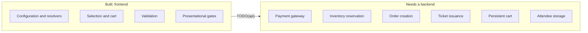

Three modes depend on backend work more heavily than the rest:

- **`application`** with `paymentTiming: "on_approval"` needs an order that exists before payment, plus a durable reference the applicant can return to. The status page cannot be faked with local state.
- **`race`** needs wave capacity that decrements independently of category availability, and bib allocation at issuance.
- **`donation`** needs an order line carrying an amount instead of a quantity, and a campaign total read from and written to the server.
